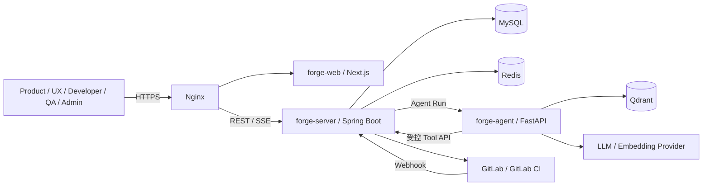
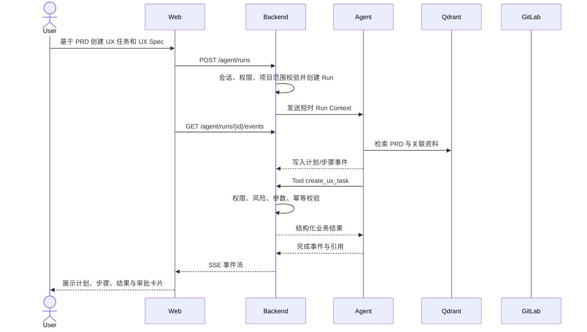
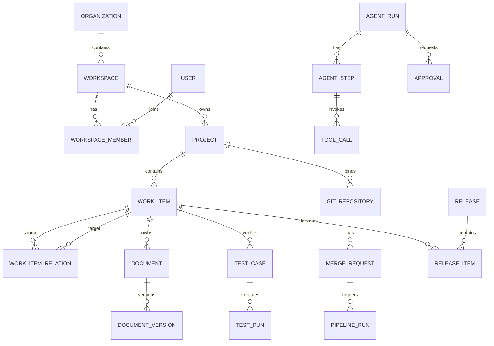
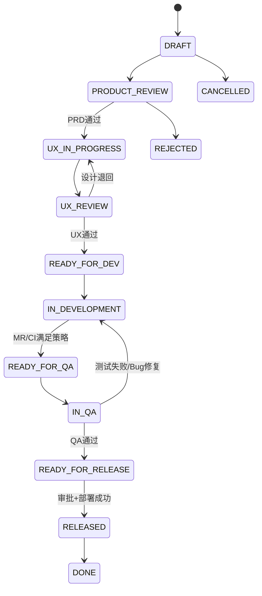
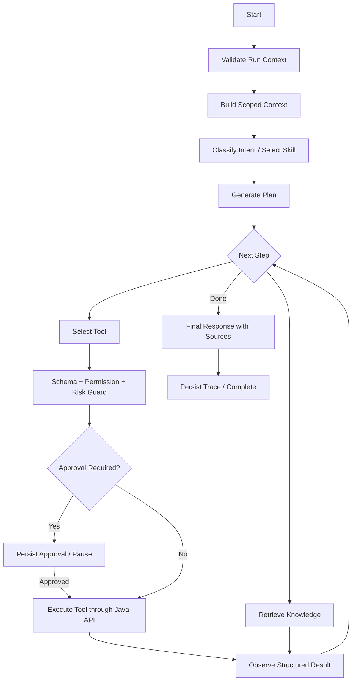
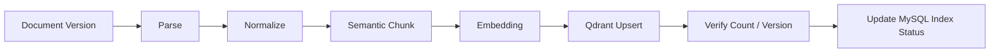
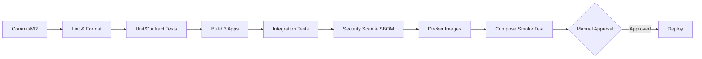

# ForgeAI 完整技术方案 v1.3

> **AI-Native Software Delivery Workbench**  
> 面向个人、小团队与小公司的开源、自托管、AI 原生软件交付工作台  
> 标准流程：**产品（Product）→ UX → 开发（Developer）→ 测试（QA）→ 发布（Release）**

| 属性 | 内容 |
|---|---|
| 文档状态 | 可进入详细设计与工程实施 |
| 版本 | v1.3 |
| 日期 | 2026-09-02 |
| 输入基线 | 《AI 研发交付工作台 PRD v0.2》《技术方案设计总览 v1.0》及前序设计上下文 |
| 目标读者 | 产品、UX、前后端、Agent、测试、运维与后续 Codex 开发任务 |
| 产品名 | ForgeAI |
| 英文副标题 | AI-Native Software Delivery Workbench |
| 仓库名 | `forge-ai` |
| GitHub | `forge-ai/forge` |
| 核心模块 | `forge-web`、`forge-server`、`forge-agent` |

---

## 1. 方案摘要

**ForgeAI** 是一个开源、自托管、AI 原生的软件交付工作台。它不是聊天机器人，也不试图重新实现 Jira、Confluence、Figma、GitLab 和 CI/CD。ForgeAI 以 `Work Item` 为交付主线，连接 PRD、UX 设计、技术方案、开发任务、代码变更、流水线、测试、缺陷与发布，并以 AI Agent 作为“理解、规划、检索、编排和解释层”。

架构采用三个独立应用和三个数据基础设施：

- **forge-web**：基于 Next.js 的团队工作台、交付视图、文档、Agent 过程与审批界面。
- **forge-server**：基于 Spring Boot 的唯一业务权威，负责身份、权限、状态机、事务、集成、审计和持久化。
- **forge-agent**：基于 FastAPI 的上下文构建、RAG、Deep Agents（基于 LangGraph）、Tool Calling、Checkpoint 和评测服务。
- **MySQL**：业务事实、配置、Agent Trace、审批与审计。
- **Redis**：Spring Session、短期执行状态、限流与必要缓存。
- **Qdrant**：由文档派生的向量索引，可从 MySQL 与附件重建。

核心安全边界是：

> Agent 永远不直接访问业务数据库，不持有 GitLab 或生产环境密钥，只能通过声明权限与风险等级的 Tool 调用 Spring Boot API；Spring Boot 在执行点重新鉴权。

MVP 采用模块化单体、REST + SSE、GitLab API 优先和 Docker Compose：本地开发使用 Docker Desktop，最终上线使用腾讯云 CVM 自托管，控制单人开发与维护成本。

---

## 2. 目标、范围与质量目标

### 2.1 技术目标

1. 跑通 Product → UX → Developer → QA → Release 端到端纵向链路。
2. 从任一需求回溯全部研发资产，形成 Delivery Graph。
3. Agent 基于受控上下文执行实际业务动作，并做到可审批、可审计、可恢复。
4. 同一套模型同时服务个人和团队；个人等价于单成员 Workspace。
5. 本地可在 Docker Desktop 通过 Docker Compose 重复启动；最终可在腾讯云 CVM 通过同一套服务拓扑部署。
6. 保持开源、自托管、模型与 GitLab 可替换，避免云厂商锁定。

### 2.2 MVP 范围

包括：登录、组织与项目、成员和 RBAC、统一 Work Item、文档与基础 RAG、UX 正式阶段、GitLab/MR/CI、测试与 Bug、发布预检、Agent Tool、审批、Trace、SSE、自托管部署。

不包括：Figma 替代品、实时多人编辑、完整 Scrum/Gantt、IM、Kubernetes、微服务、企业 SSO、复杂 ABAC、通用浏览器 Agent、无审查的自动改码和全自动生产发布。

### 2.3 非功能基线

| 维度 | MVP 基线 |
|---|---|
| 可用性 | 核心业务服务月可用性目标 99.5% |
| CRUD 性能 | 服务端 P95 < 500ms，不含外部系统 |
| Agent 响应 | 首个 SSE 业务事件目标 < 2s；长任务持续输出心跳 |
| 安全 | 租户隔离、最小权限、敏感字段加密、HIGH Tool 强制审批 |
| 可恢复 | Agent/Tool 有持久状态；SSE 断线可恢复；写操作幂等 |
| 可部署 | 本机 Docker Desktop Compose 开发；腾讯云 CVM Compose 上线；配置外置、数据卷可备份 |
| 可观测 | 请求日志、指标、审计、Agent Run/Step/Tool Trace |

---

## 3. 核心架构决策

| 领域 | 决策 | 理由 |
|---|---|---|
| 前端 | Next.js、React、TypeScript、Arco Design | 适合企业工作台；组件完整；强化类型契约 |
| 服务端状态 | TanStack Query | 缓存、失效、重试、分页职责清晰 |
| UI 状态 | Zustand | 仅保存抽屉、筛选器、草稿等局部状态 |
| 编辑器 | Tiptap | 结构化富文本和扩展能力较好 |
| 后端 | Java 21、Spring Boot 3.x 模块化单体 | 业务规则、事务和集成集中；避免过早微服务化 |
| 认证 | Spring Session Redis + Cookie + BCrypt | 自托管 Web 工作台简单可靠，可服务端撤销 |
| 授权 | 自定义认证中间件 + Custom RBAC | MVP 权限边界可控；后续可替换/接入企业认证 |
| 业务库 | MySQL 8 | 作为业务唯一事实来源 |
| Agent | Python 3.12、FastAPI、Pydantic | 适配 AI/Agent 生态，契约明确 |
| Runtime | Deep Agents（基于 LangGraph） | 状态、Tool、审批、Checkpoint 与多阶段执行 |
| 向量库 | Qdrant | 与 MySQL 解耦，支持过滤和自托管 |
| 实时事件 | SSE | Agent 主要为服务器单向事件流，无需 WebSocket 复杂度 |
| SCM/CI | GitLab Adapter + GitLab CI | 复用既有系统，不重造 Git/CI |
| 部署 | Docker Desktop（本地）+ Nginx/Docker Compose（腾讯云） | 开发环境易复现，最终上线可控 |

### 3.1 产品与代码命名基线

| 对象 | 正式名称 | 用途 |
|---|---|---|
| 产品 | `ForgeAI` | 所有 UI、文档、发行版和对外传播使用 |
| 副标题 | `AI-Native Software Delivery Workbench` | 产品定位与品牌副标题 |
| 仓库 | `forge-ai` | 本地目录、Compose Project 和制品命名基础 |
| GitHub | `forge-ai/forge` | 官方远程仓库标识 |
| Web | `forge-web` | Next.js 前端模块与镜像名 |
| Server | `forge-server` | Spring Boot 业务服务模块与镜像名 |
| Agent | `forge-agent` | FastAPI Agent 服务模块与镜像名 |

Java 根包建议使用 `ai.forge.server`；Python 包使用 `forge_agent`；前端 npm package 使用 `@forge-ai/forge-web`。Docker 镜像建议为 `forge-ai/forge-web`、`forge-ai/forge-server` 和 `forge-ai/forge-agent`，具体 Registry 前缀可由部署环境覆盖。

早期方案中的 PostgreSQL/pgvector、Tailwind/shadcn、JWT/OAuth2 和完整 Spring Security 认证栈均不再是当前 MVP 基线。未来 LDAP/OIDC/SAML 可作为企业扩展，不影响现有领域模型。

---

## 4. 系统上下文与容器架构



该图展示腾讯云最终上线拓扑。本地开发时同一组服务运行在 Docker Desktop Compose 网络中，Browser 通过 `http://localhost:<port>` 访问本机入口；MySQL、Redis 与 Qdrant 同样在本机容器中运行，不依赖 VM。

### 4.1 调用规则

- Browser 只访问 Nginx 暴露的统一域名。
- Web 不直接调用 Agent Service、MySQL、Redis、Qdrant 或 GitLab。
- Backend 是所有业务写操作和权限判断的唯一入口。
- Agent Service 只接受 Backend 的服务间请求。
- Agent Tool 回调 Backend 的内部 Tool API；Backend 根据原始用户与 Run Context 再次授权。
- Qdrant 只保存派生向量及必要过滤元数据，不保存业务唯一事实。

### 4.2 典型 Agent 时序



---

## 5. Monorepo 与代码组织

```text
forge-ai/
├── forge-web/
│   ├── src/app/
│   ├── src/features/
│   ├── src/components/
│   ├── src/lib/api/
│   └── src/stores/
├── forge-server/
│   └── src/main/java/ai/forge/server/
│       ├── auth/
│       ├── organization/
│       ├── workspace/
│       ├── project/
│       ├── member/
│       ├── workitem/
│       ├── workflow/
│       ├── document/
│       ├── gitlab/
│       ├── qa/
│       ├── release/
│       ├── agent/
│       ├── audit/
│       └── common/
├── forge-agent/
│   └── src/forge_agent/
│       ├── api/
│       ├── gateway/
│       ├── runtime/
│       ├── context/
│       ├── tools/
│       ├── skills/
│       ├── rag/
│       ├── approval/
│       ├── trace/
│       └── evaluation/
├── packages/
│   ├── forge-ui/
│   ├── forge-contracts/
│   └── forge-config/
├── deploy/
│   ├── compose/
│   ├── nginx/
│   ├── migrations/
│   └── scripts/
├── docs/
│   ├── architecture/
│   ├── api/
│   ├── agent/
│   └── adr/
└── .github/workflows/
```

若项目最终使用 GitLab CI 管理自身构建，可在根目录保留 `.gitlab-ci.yml`；若官方仓库以 GitHub `forge-ai/forge` 为主，则默认使用 `.github/workflows/`。ForgeAI 对接用户 GitLab 的产品能力与自身源码托管平台相互独立。

历史讨论中的通用目录 `apps/web`、`apps/backend`、`apps/agent` 正式替换为 `forge-web`、`forge-server`、`forge-agent`。后续代码、镜像、日志服务名与文档均使用这一命名。

### 5.1 Backend 模块规范

每个业务模块内部按 `controller → application/service → domain → repository/infrastructure` 分层。禁止 Controller 直接访问 Repository，禁止跨模块直接读取对方数据库 Repository。跨模块通过公开应用服务或领域事件协作。

### 5.2 代码注释与 Java 成员规范

项目中的**解释性注释默认使用中文**，包括 Java、TypeScript、Python、SQL Migration、YAML 配置和脚本中的设计说明、业务规则、边界条件、失败处理与 TODO。这样可以让项目的技术表达、学习笔记与面试讲解保持一致。

以下内容保持英文或按其原始协议书写：标识符、类/方法/字段名、URL、HTTP Header、SQL 关键字、框架注解、OpenAPI 字段、错误码、Git 提交类型、第三方 API 字段和面向国际用户的产品文案。禁止为“中文化”而改写行业标准或协议名。

除构建工具生成的源码外，Java 生产代码中的数据成员必须满足：

1. 普通类、抽象类和接口中声明的每个成员字段必须有中文普通块注释（`/* ... */`）。
2. 每个 `record` 组件必须分别有中文普通块注释，说明该组件在当前数据结构中的含义。
3. 每个 `enum` 常量以及 enum 内声明的每个成员字段必须分别有中文普通块注释，说明业务状态/类型含义和持久化语义；禁止用一条注释笼统覆盖多个枚举项。
4. 注释放在字段、record 组件或 enum 常量声明之前；字段存在注解时，注释放在该字段的第一条注解之前。
5. 注释至少说明成员代表什么；涉及枚举、时间、金额、密文、租户范围、版本号、删除标记或外部 ID 时，还应说明取值、单位、安全或一致性约束。
6. `id`、`workspaceId`、`version`、`createdAt`、`updatedAt`、日志对象和常量等通用成员也必须解释其在当前类型中的作用，不因名称常见而省略。
7. 本规则不要求方法参数和局部变量逐一注释，但复杂计算应在必要位置使用中文注释说明意图。
8. 不使用 Javadoc（`/** ... */`）作为字段含义注释；这些代码注释不参与 Swagger/OpenAPI 生成。Swagger 注释仍只写在 Controller。

示例：

```java
/* 所属工作区，用于服务端租户隔离查询，禁止由客户端直接信任。 */
@Column(name = "workspace_id", nullable = false, updatable = false)
private Long workspaceId;

/* 乐观锁版本；更新时必须与客户端传入的 expectedVersion 一致。 */
@Version
private Long version;

public record WorkItemSummary(
    /* 工作项唯一标识，用于后续详情查询。 */
    Long id,
    /* 工作项标题，用于列表和选择器展示。 */
    String title
) {}

public enum WorkItemStatus {
    /* 草稿状态，允许产品角色继续补充需求内容。 */
    DRAFT,
    /* 待 UX 处理状态，表示产品评审已经通过。 */
    UX_IN_PROGRESS
}
```

质量门禁在 CI 中执行：使用自定义 Checkstyle AST 规则或 JavaParser 校验任务，对字段、record 组件、enum 常量和 enum 成员字段检查紧邻的中文普通块注释；新增成员缺少符合要求的注释时构建失败。生成源码目录从检查中排除，手写测试源码建议遵守但不作为首期阻断项。`JavadocVariable` 不适用于本规则。初期若自定义规则尚未落地，Code Review 不得放行，且会话 02 必须将该规则列入待完成质量门禁，不允许长期依赖人工记忆。

### 5.3 契约管理

- Java OpenAPI 为外部 REST 契约事实来源。
- 从 OpenAPI 生成 TypeScript Client 和必要的 Python DTO。
- Tool 使用独立 JSON Schema/Pydantic Contract，并显式映射到 Java Endpoint。
- 生成物进入 `packages/forge-contracts`，不得在三端手工维护同一类型。

---

## 6. 领域模型

### 6.1 聚合与关系



### 6.2 组织与身份表

| 表 | 关键字段 |
|---|---|
| `users` | `id`, `email`, `display_name`, `password_hash`, `status`, timestamps |
| `organizations` | `id`, `name`, `slug`, `owner_user_id` |
| `workspaces` | `id`, `organization_id`, `name`, `slug`, `settings_json` |
| `workspace_members` | `workspace_id`, `user_id`, `status`, `joined_at` |
| `projects` | `id`, `workspace_id`, `key`, `name`, `description`, `status` |
| `project_members` | `project_id`, `user_id`, `role_scope` |
| `roles` | `id`, `workspace_id?`, `code`, `name`, `system_role` |
| `permissions` | `id`, `code`, `resource`, `action` |
| `member_roles` | `workspace_member_id`, `role_id`, `project_id?` |
| `role_permissions` | `role_id`, `permission_id` |

约束：`workspace.slug` 在组织内唯一；`project.key` 在 Workspace 内唯一；用户邮箱按规范化值唯一。

### 6.3 Work Item

`work_items` 是所有交付任务的统一父模型：

```text
id                  BIGINT PK
workspace_id        BIGINT NOT NULL
project_id          BIGINT NOT NULL
item_key            VARCHAR(32) NOT NULL       # PRJ-1024
type                VARCHAR(32) NOT NULL       # REQUIREMENT/UX_TASK/DEV_TASK/QA_TASK/BUG/RELEASE
title               VARCHAR(255) NOT NULL
description         LONGTEXT
status              VARCHAR(40) NOT NULL
priority            VARCHAR(16)
parent_id           BIGINT NULL
assignee_user_id    BIGINT NULL
reporter_user_id    BIGINT NOT NULL
due_at              DATETIME NULL
version             BIGINT NOT NULL DEFAULT 0  # 乐观锁
created_at/updated_at/deleted_at
```

索引：

- 唯一索引 `(project_id, item_key)`。
- 查询索引 `(project_id, type, status)`、`(workspace_id, assignee_user_id, status)`、`(parent_id)`。
- 逻辑删除记录不可复用 `item_key`。

`work_item_relations` 字段：`source_id`、`target_id`、`relation_type`、`created_by`、`created_at`，唯一约束 `(source_id, target_id, relation_type)`。关系类型包括：

- `PARENT_OF`
- `DEPENDS_ON`
- `BLOCKS`
- `RELATES_TO`
- `IMPLEMENTS`
- `VERIFIES`
- `FOUND_IN`
- `DELIVERED_BY`

### 6.4 文档模型

`documents` 保存文档元信息与当前版本指针；`document_versions` 保存不可变版本内容。

文档类型：`PRD`、`UX_SPEC`、`PROTOTYPE_SPEC`、`DESIGN_GUIDE`、`TECH_DESIGN`、`API_DOC`、`TEST_PLAN`、`TEST_REPORT`、`RELEASE_NOTE`、`GENERAL`。

关键字段：

- `documents`: `workspace_id`, `project_id`, `work_item_id?`, `type`, `title`, `current_version_id`, `visibility`, `status`。
- `document_versions`: `document_id`, `version_no`, `content_format`, `content`, `content_hash`, `created_by`。
- `document_attachments`: `document_id`, `version_id?`, `storage_key`, `mime_type`, `size`, `checksum`。
- `document_index_jobs`: `document_id`, `version_id`, `status`, `attempts`, `error`, `indexed_at`。

UX 原型在 MVP 中以 URL/附件存在于 `PROTOTYPE_SPEC`，不建立在线绘图引擎。

### 6.5 GitLab 与 CI

| 表 | 用途 |
|---|---|
| `gitlab_connections` | Workspace 的 Base URL、加密凭据引用、连接状态 |
| `git_repositories` | 远端项目 ID、URL、默认分支、最后同步时间 |
| `branches` | 分支快照及关联 Work Item |
| `merge_requests` | MR 状态、源/目标分支、远端 URL 与 Work Item |
| `pipeline_runs` | GitLab Pipeline ID、ref、commit SHA、状态、时间与摘要 |
| `webhook_deliveries` | Webhook 去重、签名校验、处理结果 |

远端 GitLab 是代码、MR 与 Pipeline 的事实来源；本地表用于关联、缓存、查询与审计。

### 6.6 QA 与发布

- `test_cases`: `project_id`, `work_item_id`, `title`, `preconditions`, `steps_json`, `expected_result`, `priority`。
- `test_runs`: 测试批次、环境、执行者、状态与统计。
- `test_results`: 用例结果、实际结果、证据附件与失败原因。
- Bug 使用 `work_items.type=BUG`；补充 `severity`、`found_in_version` 可放扩展表 `bug_details`。
- `releases`: 版本、环境、状态、计划/实际时间、审批策略与发布说明文档。
- `release_items`: Release 与 Requirement/Bug/Task 的关联。
- `deployments`: 目标环境、Pipeline、状态、执行者、开始/结束时间和回滚关联。

### 6.7 Agent 与审计

| 表 | 关键内容 |
|---|---|
| `agent_runs` | 用户请求、上下文范围、Skill、状态、模型、Token、成本、最终摘要 |
| `agent_steps` | 顺序、类型、输入/输出摘要、状态、耗时、错误 |
| `tool_calls` | Tool、参数密文/脱敏摘要、权限、风险、幂等键、结果 |
| `agent_checkpoints` | Runtime Checkpoint 引用与状态版本 |
| `approvals` | 请求、冻结参数、风险、审批人、结果、过期时间 |
| `agent_events` | SSE 可恢复事件，`run_id + sequence` 唯一 |
| `audit_logs` | 谁在何时对哪个资源执行了什么操作及结果 |

---

## 7. 研发工作流与状态机

### 7.1 主状态机



`BLOCKED` 作为附加阻塞状态或状态属性；进入与解除都必须记录原因。

### 7.2 阶段准入规则

| 转换 | 必须满足 |
|---|---|
| Product → UX | PRD 已发布，目标/范围/验收标准齐全 |
| UX → Development | UX Spec、用户流程、页面与关键交互已评审；纯后端需求可按策略留痕跳过 |
| Development → QA | Dev Task 完成，关联 MR 存在，Pipeline 达到项目策略 |
| QA → Release | 测试批次完成，无阻断缺陷，QA 结论为 PASS |
| Release → Released | Release Precheck 通过且人工审批有效 |

### 7.3 状态变更原则

- 状态机只在 Backend Workflow 模块执行。
- Agent、前端和外部 Webhook 都只能“请求转换”，不能直接更新 `status`。
- 每次转换写入 `work_item_events` 和 `audit_logs`。
- 使用 `expectedVersion` 防止并发覆盖。
- 跳过 UX 等例外需 `reason`、操作者和策略依据。

---

## 8. RBAC 与权限模型

### 8.1 系统角色

`OWNER`、`ADMIN`、`PRODUCT`、`UX`、`DEVELOPER`、`QA`、`RELEASE_APPROVER`。

用户可多角色；角色可作用于 Workspace 或特定 Project。MVP 不做通用 ABAC，但每次授权仍校验 Workspace/Project 资源归属。

### 8.2 核心权限矩阵

| 权限 | Owner/Admin | Product | UX | Developer | QA | Release Approver |
|---|:---:|:---:|:---:|:---:|:---:|:---:|
| `workspace.manage` | ✓ |  |  |  |  |  |
| `member.manage` | ✓ |  |  |  |  |  |
| `requirement.create/edit` | ✓ | ✓ | 读 | 读 | 读 | 读 |
| `ux.create/edit` | ✓ | 读/评审 | ✓ | 读 | 读 | 读 |
| `task.create/assign` | ✓ | ✓ | UX 范围 | Dev 范围 | QA 范围 |  |
| `repo.read` | ✓ |  |  | ✓ | ✓ | 读 |
| `repo.branch/mr` | ✓ |  |  | ✓ |  |  |
| `pipeline.read` | ✓ | 读 | 读 | ✓ | ✓ | ✓ |
| `pipeline.trigger` | ✓ |  |  | ✓ | 按策略 |  |
| `test.create/execute` | ✓ | 读 | 读 | 读 | ✓ | 读 |
| `bug.create/edit` | ✓ | 读 | 读 | 处理 | ✓ | 读 |
| `release.create` | ✓ | 读 | 读 | 读 | 读 | ✓ |
| `release.deploy/rollback` | ✓/审批 |  |  |  |  | ✓/审批 |

实际权限由表配置；此矩阵是默认种子数据。

### 8.3 Agent 有效权限

```text
Effective Tool Permission
  = User Permissions
  ∩ Skill Tool Allowlist
  ∩ Project Policy
  ∩ Resource Scope
  ∩ Risk/Approval Policy
```

前端隐藏按钮不是安全措施；Controller、Application Service 和 Tool Executor 必须在服务端校验。

---

## 9. 认证与会话安全

### 9.1 登录流程

1. `POST /api/v1/auth/login` 接收邮箱和密码。
2. 登录限流，读取用户并用 BCrypt 校验。
3. 轮换 Session ID，Spring Session 保存到 Redis。
4. 返回 HttpOnly Cookie；生产环境启用 `Secure`、合适的 `SameSite` 和作用域。
5. 后续请求由自定义认证 Filter 从 Session 构建 `AuthContext`。

### 9.2 安全要求

- 修改状态的 Cookie 请求使用 CSRF Token。
- Session 设置空闲和绝对过期时间，支持单会话/全会话撤销。
- 登录、密码修改、凭据更新和权限变更写审计。
- GitLab Token、模型 Key 和部署凭据采用应用层信封加密；主密钥从 Secret 注入。
- 错误响应不泄露用户是否存在、内部堆栈或外部 Token。
- 企业 OIDC/SAML/LDAP 后续作为新的 Identity Provider，不改变 User/Role/Permission 主模型。

### 9.3 服务间认证

Backend 创建 Agent Run 后签发短时 `run-scoped credential`，只含 `run_id`、主体 ID、Workspace/Project 范围、过期时间和随机 nonce。Agent 调用内部 Tool API 时携带该凭据。Backend 必须从数据库读取 Run 与原始用户当前权限，不信任 Agent 自报权限。

---

## 10. API 设计

### 10.1 API 约定

- 前缀 `/api/v1`，JSON 使用 camelCase，时间使用 ISO-8601 UTC。
- 列表统一 `items/page/pageSize/total`；游标分页用于事件流和大量审计数据。
- 错误结构包含 `code`、`message`、`requestId`、`details?`。
- 写接口支持 `Idempotency-Key`；更新请求带 `expectedVersion`。
- 所有请求生成 `X-Request-ID`，贯穿 Backend、Agent 与外部适配器。

### 10.1.1 Swagger / OpenAPI

`forge-server` 使用 **springdoc-openapi** 生成 OpenAPI 3 文档，并提供 Swagger UI，作为后端 REST 契约的可视化、调试和联调入口。Spring Boot 3.x 不采用已停止维护的 Springfox。

| 项目 | 约定 |
|---|---|
| OpenAPI JSON | `/v3/api-docs` |
| Swagger UI | `/swagger-ui/index.html` |
| 分组 | `Public API`（`/api/v1/**`）、`Internal Agent API`（`/internal/v1/**`，默认不在 UI 暴露） |
| Controller 文档 | 仅在 Controller 使用 `@Tag`、`@Operation`、`@Parameter`、`@ApiResponses`，描述使用中文 |
| 安全定义 | 声明 Cookie Session + CSRF Header；仅供“试用”的接口必须按真实安全策略校验 |
| 生成链路 | CI 从 `/v3/api-docs` 或 build artifact 导出 `openapi.json`，校验破坏性变更并生成 TypeScript Client/必要 Python DTO |

Swagger 不替代认证、授权和测试。Swagger UI 的“Try it out”在开发/测试环境可用；生产环境默认关闭，或仅允许 Owner/Admin 经 Nginx/应用权限保护后访问。`/internal/v1/**` 不对外公开，Agent 服务间认证不通过 Swagger UI 演示。

Swagger 注释仅写在 Controller，不在 Entity、Request DTO 或 Response DTO 中添加 Swagger 注解；Java 字段、record 组件和 enum 常量的中文普通块注释也不直接自动生成 API 文档。每个公开接口在 Controller 至少文档化权限、请求参数、成功响应、常见失败码、幂等要求与乐观锁要求。SSE 接口还需说明事件类型、`Last-Event-ID` 与重连语义。

### 10.2 主要资源 API

```text
# Auth / Workspace
POST   /api/v1/auth/login
POST   /api/v1/auth/logout
GET    /api/v1/me
GET    /api/v1/workspaces
POST   /api/v1/workspaces
POST   /api/v1/workspaces/{id}/members

# Project / Work Item
GET    /api/v1/projects
POST   /api/v1/projects
GET    /api/v1/projects/{id}/delivery-graph
GET    /api/v1/work-items
POST   /api/v1/work-items
GET    /api/v1/work-items/{id}
PATCH  /api/v1/work-items/{id}
POST   /api/v1/work-items/{id}/relations
POST   /api/v1/work-items/{id}/transitions

# Document / RAG
GET    /api/v1/documents
POST   /api/v1/documents
POST   /api/v1/documents/{id}/versions
POST   /api/v1/documents/{id}/attachments
POST   /api/v1/documents/{id}/reindex

# GitLab / CI
POST   /api/v1/gitlab/connections
POST   /api/v1/gitlab/connections/{id}/test
POST   /api/v1/gitlab/repositories/bind
POST   /api/v1/gitlab/branches
POST   /api/v1/gitlab/merge-requests
POST   /api/v1/gitlab/pipelines
GET    /api/v1/gitlab/pipelines/{id}/logs
POST   /api/v1/gitlab/webhooks/{connectionId}

# QA / Release
POST   /api/v1/test-cases
POST   /api/v1/test-runs
POST   /api/v1/test-runs/{id}/results
POST   /api/v1/releases
POST   /api/v1/releases/{id}/precheck
POST   /api/v1/releases/{id}/deployments

# Agent
POST   /api/v1/agent/runs
GET    /api/v1/agent/runs/{id}
GET    /api/v1/agent/runs/{id}/events
POST   /api/v1/agent/runs/{id}/cancel
POST   /api/v1/approvals/{id}/approve
POST   /api/v1/approvals/{id}/reject
```

### 10.3 状态转换示例

```json
POST /api/v1/work-items/1024/transitions
{
  "action": "SUBMIT_UX_REVIEW",
  "expectedVersion": 7,
  "reason": "用户流程和关键交互已完成"
}
```

### 10.4 Agent Run 示例

```json
POST /api/v1/agent/runs
{
  "projectId": 10,
  "workItemId": 1024,
  "skill": "UX",
  "message": "根据 PRD 创建 UX 任务并生成 UX Spec 草稿",
  "clientRequestId": "01K..."
}
```

响应只返回持久化 Run：

```json
{
  "runId": "ar_01K...",
  "status": "QUEUED",
  "eventsUrl": "/api/v1/agent/runs/ar_01K.../events"
}
```

---

## 11. SSE 事件协议

### 11.1 事件类型

- `agent.started`
- `context.ready`
- `plan.created`
- `step.started`
- `tool.requested`
- `approval.required`
- `tool.started`
- `tool.completed`
- `step.completed`
- `agent.completed`
- `agent.failed`
- `agent.cancelled`
- `heartbeat`

### 11.2 事件格式

```text
id: 18
event: tool.completed
data: {"runId":"ar_01K...","sequence":18,"timestamp":"2026-08-21T12:00:00Z","payload":{"toolCallId":"tc_123","tool":"create_ux_task","status":"SUCCEEDED","resource":{"type":"WORK_ITEM","id":2048}}}
```

`agent_events(run_id, sequence)` 持久化关键业务事件。客户端用 `Last-Event-ID` 重连；重复事件按 sequence 去重。心跳可不持久化。Run 最终状态以 Backend 数据库为准，SSE 断开不取消任务。

---

## 12. Agent 架构

### 12.1 运行图



### 12.2 Agent State

```python
class AgentState(TypedDict):
    run_id: str
    user_id: int
    workspace_id: int
    project_id: int
    work_item_id: int | None
    skill: str
    messages: list
    intent: dict | None
    plan: list[dict]
    current_step: int
    context_refs: list[dict]
    retrieved_chunks: list[dict]
    tool_results: list[dict]
    pending_approval_id: str | None
    error: dict | None
    final_response: str | None
```

### 12.3 Skills

| Skill | 输入重点 | 允许的典型 Tool | 禁止或需升级的动作 |
|---|---|---|---|
| Product | 项目目标、需求、历史 PRD | 读项目、创建/更新需求与 PRD、拆任务 | Git/部署 |
| UX | PRD、用户、现有设计规范 | 创建 UX Task/UX 文档、提交 UX Review | Git/生产操作 |
| Developer | PRD + UX + 技术文档 + 仓库/CI | 技术方案、Dev Task、Branch、MR、Pipeline | 生产合并/部署需 HIGH 审批 |
| QA | PRD + UX + API + MR/Pipeline | 测试用例、Test Run、Bug、质量报告 | 改代码/生产部署 |
| Release | CI + QA + Bug + Release Policy | Precheck、Release Note、审批请求 | Deploy/Rollback 必须审批 |

MVP 使用代码或 YAML 配置 Skill 的 Prompt、可用 Tool 和上下文模板；数据库配置化推迟到行为稳定之后。

### 12.4 运行状态

`QUEUED → RUNNING → WAITING_APPROVAL → RUNNING → SUCCEEDED`，异常终态为 `FAILED`、`CANCELLED`、`EXPIRED`。等待审批时保存 Checkpoint；审批后从确定节点恢复，不能重新执行已成功写操作。

---

## 13. Tool Contract

### 13.1 Contract 结构

```yaml
name: create_ux_task
version: 1
description: Create a UX task under an existing requirement.
required_permission: ux.create
risk_level: MEDIUM
idempotent: true
timeout_ms: 5000
input_schema:
  type: object
  required: [requirementId, title]
  properties:
    requirementId: { type: integer }
    title: { type: string, minLength: 1, maxLength: 255 }
    description: { type: string, maxLength: 10000 }
    assigneeId: { type: [integer, "null"] }
backend:
  method: POST
  path: /internal/v1/tools/ux-tasks
```

### 13.2 Tool 分组

**通用读取**

- `get_project`
- `get_work_item`
- `list_related_work_items`
- `get_delivery_graph`
- `search_documents`
- `get_document`

**Product**

- `create_requirement`
- `update_requirement`
- `create_prd_document`
- `create_child_work_items`
- `submit_product_review`

**UX**

- `create_ux_task`
- `create_ux_document`
- `update_ux_document`
- `link_prototype`
- `submit_ux_review`

**Developer/GitLab**

- `create_dev_task`
- `create_tech_design`
- `create_branch`
- `create_merge_request`
- `trigger_pipeline`
- `get_pipeline`
- `get_pipeline_logs`

**QA/Release**

- `create_qa_task`
- `create_test_case`
- `create_test_run`
- `create_bug`
- `update_bug`
- `release_precheck`
- `create_release`
- `deploy_release`
- `rollback_release`

### 13.3 风险等级

| 等级 | 默认策略 | 示例 |
|---|---|---|
| LOW | 有权限直接执行 | 读 Work Item、文档检索、查看 Pipeline |
| MEDIUM | Workspace 可配置自动/确认 | 创建任务、文档、分支、MR、触发 Pipeline |
| HIGH | 永远人工审批 | 合并受保护分支、生产部署、回滚、删除 |

### 13.4 执行生命周期

1. Runtime 选择 Tool 并生成结构化参数。
2. Agent Registry 校验 Tool 是否属于当前 Skill、Schema 是否有效。
3. Backend 根据 Run、当前用户、资源范围和最新权限重新校验。
4. 风险策略要求审批时冻结 Tool 名称、版本、参数摘要和资源版本。
5. 审批通过后再次校验权限、资源版本和过期时间。
6. Executor 使用 `Idempotency-Key = runId + toolCallId` 调用应用服务。
7. 写入 Tool Call、业务事件和审计日志，返回结构化结果。
8. Agent 只能根据结构化结果解释，不把模型推测当作执行成功。

---

## 14. Context Engineering 与 RAG

### 14.1 上下文层级

```text
L1 Current User / Role / Effective Permissions
L2 Workspace / Project / Policies
L3 Current Work Item / Workflow / Assignee
L4 Related PRD / UX / Tech / API Documents
L5 Related Tasks / MR / Pipeline / QA / Bug / Release
L6 Permission-filtered Retrieved Knowledge
```

按 Skill 选择最小上下文：

- Product：项目目标、相关历史需求和业务文档。
- UX：当前 PRD、验收标准、现有 Design Guide、相似 UX Spec。
- Developer：PRD + UX Spec + Tech/API Docs + 关联仓库/MR/CI。
- QA：PRD + UX Spec + API/MR + 风险与历史缺陷。
- Release：CI + 测试结论 + 未关闭 Bug + 发布策略。

### 14.2 索引管线



Qdrant payload 至少包含：`workspace_id`、`project_id`、`work_item_id`、`document_id`、`version_id`、`document_type`、`visibility`、`content_hash`、`chunk_index`。

### 14.3 检索流程

1. Backend/Agent 确定用户可访问的 Workspace、Project、Work Item 和文档范围。
2. 生成带租户与权限过滤器的 Qdrant 查询。
3. 向量召回 Top-K，必要时关键词混合检索和重排。
4. 去重、压缩并控制 Token Budget。
5. 将来源 ID、版本、标题和片段位置传入 Agent。
6. 最终回答保留可回溯引用；无足够依据时明确说明。

### 14.4 安全与一致性

- 检索过滤必须在服务端/Qdrant Query 层完成，不能先召回后仅靠 Prompt 过滤。
- 文档新版本成功索引后再切换活动版本；旧版本按策略删除或标记不可检索。
- 权限变更、项目删除和文档删除触发索引失效。
- 上传内容视为不可信数据，防提示注入；文档文字不能改变系统/Tool 权限。
- MySQL 是事实来源，Qdrant 可完全重建。

---

## 15. GitLab 与 CI/CD 集成

### 15.1 连接模型

Workspace 管理员配置 `baseUrl` 与 Personal/Project Access Token。Token 加密后保存，Agent 和前端永远看不到明文。连接测试检查 API 版本、身份、最小权限和网络可达性。

### 15.2 Adapter 职责

- Base URL、自建证书、分页、限流、超时和错误映射。
- 仓库、分支、MR、Pipeline 与 Log 的标准化 DTO。
- 写操作的幂等与命名规则，例如 `feature/{workItemKey}-{slug}`。
- Webhook 签名/Secret 校验、Delivery ID 去重和异步处理。
- 记录远端 URL 与 ID，避免复制完整代码数据。

### 15.3 事件同步

GitLab Webhook 更新 MR/Pipeline 状态并生成领域事件；定时同步修复漏事件。发生冲突时以 GitLab 远端状态为准，但本地业务状态是否推进仍由 Workflow Policy 决定。

### 15.4 API 优先

GitLab 有 API 的能力全部使用 API。Playwright Browser Tool 只在后续用于无 API 的第三方系统，并在独立沙箱中运行。

---

## 16. 前端信息架构

### 16.1 页面结构

```text
/login
/workspaces
/w/{workspace}/projects
/w/{workspace}/p/{project}/overview
/w/{workspace}/p/{project}/work-items
/w/{workspace}/p/{project}/work-items/{key}
/w/{workspace}/p/{project}/documents
/w/{workspace}/p/{project}/ux
/w/{workspace}/p/{project}/development
/w/{workspace}/p/{project}/qa
/w/{workspace}/p/{project}/releases
/w/{workspace}/p/{project}/agent-runs/{runId}
/w/{workspace}/settings/members
/w/{workspace}/settings/integrations
/w/{workspace}/settings/permissions
```

### 16.2 Work Item 详情布局

- 顶部：编号、类型、状态、优先级、负责人、阶段动作。
- 主区：描述和角色对应文档（PRD/UX/Tech/Test）。
- 右侧：关联项、依赖、活动与审批。
- 底部/独立页：Delivery Graph、MR/CI、测试、Bug、Release。
- Agent 抽屉：当前上下文、执行计划、逐步事件、引用、审批卡片和最终结果。

### 16.3 状态管理

- TanStack Query：资源查询、分页、缓存、变更后失效。
- Zustand：选中节点、筛选器、抽屉状态和未提交 UI 草稿。
- SSE 使用独立 Run Store，按 sequence reducer 更新，不把全部事件塞入全局 Query Cache。
- 所有权限相关 UI 仅用于体验；提交时以服务端结果为准。

### 16.4 组件、Hooks 与文件拆分规范

前端代码按 Feature 组织，并以职责边界拆分组件与 Hooks。禁止把路由、数据请求、状态编排、表单校验、复杂 JSX、弹窗和工具函数集中在同一个 `page.tsx` 或业务组件文件中。

```text
features/work-items/
├── api/
│   ├── query-keys.ts
│   ├── queries.ts
│   └── mutations.ts
├── components/
│   ├── work-item-header.tsx
│   ├── work-item-form.tsx
│   ├── transition-dialog.tsx
│   └── activity-timeline.tsx
├── hooks/
│   ├── use-work-item-detail.ts
│   └── use-work-item-transition.ts
├── schemas/
│   └── work-item-form.schema.ts
├── utils/
│   └── work-item-display.ts
└── index.ts
```

拆分规则：

1. `app/**/page.tsx` 只负责读取路由参数、页面级权限/错误边界和 Feature 组合，不直接承载复杂业务实现。
2. 展示组件通过 props 接收数据；查询、Mutation、SSE 订阅和跨组件状态编排进入对应 Feature Hook。
3. 表单 Schema、默认值转换、表格列定义、Dialog/Drawer 和复杂 Timeline 独立成文件，避免主组件同时承担多种职责。
4. 一个自定义 Hook 只负责一类状态或副作用；纯计算逻辑进入 `utils`，不能为了“复用”把所有逻辑塞进一个万能 Hook。
5. Feature 对外只通过 `index.ts` 暴露稳定入口；禁止跨 Feature 深层 import，禁止形成循环依赖。
6. 只有出现两个真实调用方且语义稳定后，业务组件才提升到共享目录；`src/components` 只存无领域依赖的通用 UI。
7. 测试与组件/Hook 就近放置；生成 Client 和生成类型不得手工拆改。
8. 禁止出现万能 `components.tsx`、`hooks.ts`、`utils.ts` 或持续膨胀的 `types.ts`。文件名应表达具体领域职责。

规模是评审信号而非机械目标：`page.tsx` 建议不超过 150 行，业务组件或 Hook 建议不超过 200 行；手写业务文件超过 300 行必须在合并前完成职责审查和拆分，确有不可拆理由时在 Review 中说明。生成代码、声明式配置和测试 Fixture 不受该行数规则限制。

---

## 17. 安全设计

### 17.1 主要威胁与控制

| 威胁 | 控制 |
|---|---|
| 跨 Workspace 越权 | 每次查询带 Workspace/Project 条件；服务端资源归属校验；权限矩阵测试 |
| Session 劫持/固定 | HTTPS、HttpOnly/Secure/SameSite、登录后轮换、撤销、超时 |
| CSRF | 修改请求使用 CSRF Token；校验 Origin/Referer |
| 提示注入 | 文档视为数据；系统指令隔离；Tool 白名单；参数和权限在代码层校验 |
| Agent 越权 | Run-scoped credential、有效权限交集、Backend 执行点重新鉴权 |
| SSRF | URL allowlist、阻止内网/元数据地址、GitLab Base URL 管理员配置与校验 |
| 密钥泄露 | 信封加密、Secret 注入、日志脱敏、前端不可见 |
| 恶意附件 | 类型/大小限制、校验和、隔离解析、可选恶意软件扫描 |
| 重放/重复写 | Idempotency-Key、nonce、审批过期、Tool 状态机 |
| 供应链风险 | 锁定依赖、镜像扫描、SBOM、可信镜像来源 |

### 17.2 审计要求

以下动作必须审计：登录失败、成员/角色变更、GitLab/模型凭据变更、状态转换、Agent Run、Tool Call、审批、分支/MR/Pipeline 写操作、发布、回滚和删除。

审计记录使用追加写语义；管理员可查询但不能通过普通 API 修改。

---

## 18. 可靠性与并发控制

- Work Item、Document 当前版本和 Release 使用乐观锁。
- Tool 写操作必须有幂等键；成功结果可重放给 Agent，但不得重复执行业务动作。
- 外部读取允许指数退避重试；HIGH 写操作不自动重试。
- GitLab 调用设置连接/读取超时，失败转换为稳定错误码。
- Agent 每一步持久化状态，等待审批时 Checkpoint；恢复时从最后成功节点继续。
- SSE 断开不终止任务，重连补发关键事件。
- 文档索引失败进入重试队列，超过次数转人工处理，不影响文档本身可读。
- 所有异步任务支持死信/失败表；MVP 可用数据库 Outbox + Worker 轮询，避免一开始引入 Kafka。

### 18.1 Outbox 建议

业务事务内写入 `outbox_events`，Worker 负责 GitLab 同步、索引和异步 Agent 触发。处理成功记录 `processed_at`；消费者按 `event_id` 幂等。MVP 可由 Backend 定时任务实现，规模上升后再迁移消息队列。

---

## 19. 可观测性与评测

### 19.1 日志与 Trace

- JSON 结构化日志，统一 `requestId`、`runId`、`toolCallId`。
- Backend HTTP、数据库与 GitLab Adapter 记录时延和结果码。
- Agent 保存 Run → Step → Tool 层级轨迹、模型、Token、耗时与错误。
- Prompt、文档和 Tool 参数默认保存脱敏摘要；完整正文按部署策略配置。

### 19.2 指标

**系统指标**：请求量、错误率、P50/P95/P99、连接池、Redis/Qdrant/MySQL 健康、SSE 连接数。

**业务指标**：各阶段停留时间、阻塞数、交付完成率、Bug 严重度、发布预检失败原因。

**Agent 指标**：任务成功率、Tool Selection Accuracy、Tool 成功/拒绝率、审批率、首事件时间、Token、成本、RAG 引用率。

### 19.3 Evaluation

首批建立 20–50 个固定 Case，覆盖：

- PRD 生成与需求拆分。
- UX Task、用户流程和页面清单。
- 基于 PRD + UX 的 Dev Task/技术方案。
- 测试用例和 Bug 关联。
- Release Precheck。
- 越权、危险动作和提示注入拒绝。

每个 Case 包含输入上下文、期望 Tool、禁止 Tool、是否审批、结构化输出断言和人工评分维度。确定性的 Schema/权限契约测试进入 CI；模型质量评测单独形成报告，避免随机性阻塞全部构建。

---

## 20. 测试策略

### 20.1 Backend

- Domain/Workflow 状态机单元测试。
- 默认角色权限矩阵与跨租户越权测试。
- Repository 与 Flyway Migration 集成测试。
- Session、CSRF、幂等和并发更新测试。
- GitLab Adapter 使用 Stub Server/沙箱项目。

### 20.2 Agent

- Tool Schema、Permission、Risk 与 Endpoint 映射契约测试。
- Context Builder 范围与脱敏测试。
- RAG Workspace/Project 权限过滤测试。
- Checkpoint、审批恢复、取消和失败重试测试。
- 固定模型响应或 Fake LLM 的确定性图测试。

### 20.3 Web 与 E2E

- 关键组件、表单验证、权限状态与 SSE Reducer 测试。
- Product → UX → Dev → QA → Release 黄金链路。
- SSE 断线重连、重复事件和审批卡片。
- GitLab Pipeline 成功/失败、QA 回退和发布阻断场景。

### 20.4 安全测试

跨租户 ID 枚举、CSRF、SSRF、恶意文档提示注入、上传绕过、Token 日志泄漏、审批重放和 Run Credential 过期。

---

## 21. 部署方案：本地 Docker Desktop 开发 + 腾讯云上线

### 21.1 本地开发 Docker Desktop Compose

本地开发、测试、黄金 Demo 与每轮 Codex 会话使用 Docker Desktop。MySQL、Redis、Qdrant、Agent、Worker 和应用服务位于同一个本机 Compose Network；MySQL/Qdrant 使用命名 Volume 持久化，Redis 默认可不持久化。

```text
本机浏览器
   │ http://localhost:<port>
本机入口代理（可选）或 forge-web
   ├── forge-web
   ├── forge-server
   ├── forge-agent
   ├── worker(optional)
   ├── mysql      -> 命名 Volume
   ├── redis
   └── qdrant     -> 命名 Volume
```

默认只映射浏览器需要的本机入口端口；MySQL、Redis、Qdrant、Agent 和 Worker 不发布宿主机端口。调试所需端口仅在本地 override Compose 文件中临时映射，禁止提交到默认生产 Compose。`docker compose down -v` 会删除本地开发数据，只能在明确重置环境时执行。

### 21.2 腾讯云 Docker Compose 上线拓扑

```text
Internet
   │ 443
 Nginx
   ├── /              -> forge-web:3000
   ├── /api           -> forge-server:8080
   └── /api/.../events-> forge-server:8080 (SSE buffering off)

Private Docker Network
   ├── forge-web
   ├── forge-server
   ├── forge-agent
   ├── worker(optional)
   ├── mysql
   ├── redis
   └── qdrant
```

MySQL、Redis、Qdrant 与 Agent 不暴露公网端口。Nginx 对 SSE 关闭代理缓冲并增加合理读超时。

### 21.3 配置分类

- 本地：Docker Desktop 入口端口、时区、日志级别、上传限制。
- 腾讯云：域名、TLS、Nginx、时区、日志级别、上传限制。
- Backend：数据库、Redis、Session、加密主密钥、Agent 内网地址。
- Agent：Backend 内部地址、服务凭据、LLM/Embedding Provider、Qdrant。
- 集成：GitLab Base URL/Token 由管理员在工作台配置并加密保存。

仓库只提供 `.env.example`，不得提交真实密钥。

### 21.4 腾讯云建议

MVP 可使用一台 4C8G 起步 CVM；视模型调用与文档量调整。系统盘与数据盘分离，数据卷放在数据盘；安全组仅开放 22（限制来源）、80/443。域名与 TLS 由 Nginx/ACME 或腾讯云证书管理。若使用外部 LLM，确认网络、延迟和数据合规要求。

### 21.5 备份与恢复

- 本地：备份 MySQL/Qdrant 命名 Volume、附件和加密主密钥；重要演示前执行一次恢复演练。
- 腾讯云 MySQL：每日全量 + binlog（生产建议），定期恢复演练。
- 腾讯云附件：数据卷快照或 S3 兼容对象存储版本化。
- 腾讯云 Qdrant：快照；同时保证可从文档版本重建。
- Redis Session 可不做灾备事实源；重启后允许用户重新登录。
- 加密主密钥单独安全备份，缺失时密文不可恢复。

### 21.6 升级

1. 锁定镜像版本和 commit SHA。
2. 升级前备份 MySQL、附件和密钥。
3. 先执行兼容性检查和 Flyway Migration。
4. 本地先使用 Docker Desktop 更新服务并运行 Smoke Test，再在腾讯云按同一镜像版本更新。
5. 失败时回滚镜像；数据库 Migration 必须设计向后兼容或提供明确恢复流程。

---

## 22. CI/CD 流水线



Web 执行 lint、typecheck、unit test、build；Backend 执行 unit/integration、Migration 校验和 package；Agent 执行 lint、typecheck、Tool Contract、图测试和 Eval Smoke。三套镜像用同一 commit SHA 标记，防止版本漂移。

---

## 23. 开源与自托管交付

ForgeAI 仓库至少包含：

- 开源许可证、贡献指南、行为准则和安全报告方式。
- README、架构图、Quick Start、环境变量说明。
- `docker compose up` 所需配置和初始化管理员流程。
- 数据迁移、备份、恢复和升级文档。
- 示例项目、黄金 Demo 数据与开发模式 Mock Provider。
- ADR、OpenAPI/Swagger 使用说明、Tool Contract 和权限矩阵。

### 23.1 README 首段

官方 README 必须以如下产品定位开篇：

> ForgeAI is an open-source, self-hosted AI-native software delivery workbench. It connects Product, UX, Development, QA and Release workflows with AI Agents, enabling teams to manage requirements, documents, code collaboration, CI/CD and delivery automation in one workspace.

建议紧随其后展示副标题 `AI-Native Software Delivery Workbench`、Product → UX → Development → QA → Release 主流程、Quick Start、产品截图、架构图与在线 Demo。

许可证需结合商业计划单独决策：希望广泛嵌入可评估 Apache-2.0；希望网络部署修改也回馈社区可评估 AGPL-3.0。该选择不阻塞代码结构，但应在公开发布前确定。

默认不上传业务内容遥测；可选遥测必须透明、可关闭、不得包含文档正文、Prompt、Token 或密钥。

---

## 24. 实施计划

### Phase 0：工程骨架（1–2 周）

- Monorepo、三应用骨架、本机 Docker Desktop Compose 与本地入口代理。
- 本机 Docker Desktop 中的 MySQL/Redis/Qdrant、Flyway、统一日志与 CI。
- springdoc-openapi、Swagger UI、OpenAPI 生成链路和基础健康检查。
- Java 字段、record 组件和 enum 常量中文普通块注释质量规则及正反例测试。

**出口：** 新环境可一键启动；三应用互通；CI 全绿。

### Phase 1：身份与团队（2 周）

- Cookie Session、登录/退出、BCrypt、CSRF。
- Organization/Workspace/Project/成员与默认 RBAC。
- 审计基础设施。

**出口：** 单人和多人 Workspace 可用，权限隔离测试通过。

### Phase 2：交付核心（2–3 周）

- 统一 Work Item、Relation、文档版本、状态机。
- Product 与 UX 纵向切片。
- Delivery Graph 初版。

**出口：** Requirement → PRD → UX Task/UX Spec → Ready for Dev 跑通。

### Phase 3：Developer 与 GitLab（2–3 周）

- GitLab Connection/Repository Adapter。
- Tech Design、Dev Task、Branch、MR、Pipeline 与 Webhook。

**出口：** 从需求创建 Dev Task 和分支/MR，并实时同步 CI。

### Phase 4：QA 与 Release（2 周）

- Test Case/Run/Result、Bug、回归。
- Release、Precheck、审批与 Deployment 记录。

**出口：** QA 失败可回流开发；发布能被 CI/QA/Bug 正确阻断。

### Phase 5：Agent（3–4 周）

- Context Builder、RAG、Skill、Tool Registry。
- Run/Step/Tool Trace、SSE、Checkpoint、审批。
- Product/UX/Developer/QA/Release 黄金 Case。

**出口：** Agent 在真实权限和上下文下完成黄金 Demo，危险动作不能越权。

### Phase 6：交付打磨（1–2 周）

- E2E、Eval、性能与安全测试。
- 本机 Docker Desktop 启动、备份、恢复、升级和示例数据。
- 腾讯云 CVM Compose/Nginx/TLS 上线 Runbook 与验收。
- Demo 视频、架构文档与公开发布准备。

---

## 25. 黄金 Demo 验收

以“新增手机号登录”为例：

1. Product 创建 Requirement，Agent 生成 PRD 和验收标准。
2. UX Agent 读取 PRD，创建 UX Task，生成用户流程、页面清单、正常/异常状态和交互要求。
3. UX 评审通过后进入 Ready for Development。
4. Developer Agent 读取 PRD + UX，生成技术方案和 Dev Tasks；人工确认后创建 GitLab 分支/MR并触发 CI。
5. QA Agent 读取 PRD + UX + API/MR，生成 Test Cases；失败项生成关联 Bug 并回流开发。
6. 修复后 CI 与回归通过，Release Agent 汇总 CI/QA/Bug 并生成 Release Precheck。
7. 人工批准生产发布，系统记录 Deployment 和 Release Note。
8. Delivery Graph 能完整展示 Requirement → PRD → UX → Tech/Task → MR/CI → Test/Bug → Release。

验收硬条件：

- UX 是真实角色、任务、文档、权限和准入阶段，而非展示标签。
- Agent 不能直接访问数据库或外部密钥。
- HIGH Tool 未审批绝不执行；审批过期或资源版本变化会拒绝。
- SSE 断线后可恢复 Run 状态。
- 跨 Workspace 资源不可查询、检索或通过 Tool 操作。
- 全新 Docker Desktop 本机环境可按文档启动并完成 Demo；最终可按 Runbook 部署到腾讯云 CVM。

---

## 26. 风险与应对

| 风险 | 影响 | 应对 |
|---|---|---|
| MVP 范围过大 | 无法完成完整闭环 | 以黄金 Demo 纵向切片，暂缓 Figma/Browser/K8s 等能力 |
| Agent 行为不稳定 | 错误工具或参数 | Tool Schema、白名单、结构化输出、审批、固定 Eval |
| 权限遗漏 | 数据泄露或越权操作 | Backend 执行点鉴权、租户条件、权限矩阵和安全测试 |
| Deep Agents/LangGraph 版本变动 | Runtime 维护成本 | 锁版本、封装 Runtime 接口、ADR 记录升级 |
| 外部 GitLab 不稳定 | 同步延迟、重复操作 | Adapter、超时、幂等、Webhook + 定时补偿 |
| Qdrant 与文档不一致 | 错误检索 | 版本化索引、状态表、可重建和一致性任务 |
| 自托管升级困难 | 用户数据风险 | Flyway、固定镜像、备份/恢复演练、向后兼容迁移 |
| 模型成本/数据合规 | 难以落地企业 | Provider 抽象、Token Budget、最小上下文、自带 Key/本地模型扩展 |

---

## 27. ADR 清单

| ADR | 决策 |
|---|---|
| ADR-001 | 模块化单体而非业务微服务 |
| ADR-002 | Java 为业务权威，Python 为独立 Agent Service |
| ADR-003 | MySQL 业务库 + Qdrant 派生向量库 |
| ADR-004 | Redis Cookie Session，MVP 不采用 JWT/OAuth2 |
| ADR-005 | Agent 仅通过 Tool Contract 调用 Java API |
| ADR-006 | 统一 Work Item 与 Delivery Graph |
| ADR-007 | UX 为正式角色、阶段、任务、文档与 Skill |
| ADR-008 | SSE 而非 WebSocket |
| ADR-009 | GitLab API/CI Adapter，API 优先 |
| ADR-010 | Docker Compose 自托管优先 |
| ADR-011 | OpenAPI 为跨端业务契约来源 |
| ADR-012 | 数据库 Outbox 起步，暂不引入重型消息队列 |
| ADR-013 | 使用 springdoc-openapi 与 Swagger UI 作为 REST 契约可视化和联调入口 |
| ADR-014 | 本地开发使用 Docker Desktop 运行依赖服务，最终上线使用腾讯云 CVM |

---

## 28. 下一步详细设计清单

按以下顺序进入工程设计：

1. 完整 ERD 与 Flyway V1 表结构。
2. Work Item 状态机动作表、准入规则和异常分支。
3. 默认 RBAC 权限矩阵与服务端授权点清单。
4. OpenAPI/Swagger v1：Auth、Workspace、Project、Work Item、Document；补齐中文 API 描述、安全定义与错误码。
5. Tool Contract v1：通用读取 + Product + UX。
6. Agent Deep Agents 图节点、状态、Checkpoint 与审批恢复协议。
7. SSE Event Schema 与前端 Reducer。
8. GitLab Adapter SPI、错误码和 Webhook Contract。
9. 本机 Docker Desktop Compose、腾讯云 Compose/Nginx、Secret、备份与初始化管理员方案。
10. 黄金 Demo 的 E2E 和 Agent Eval 数据集。
11. Java 字段、record 组件和 enum 常量中文普通块注释的 Checkstyle AST/JavaParser 质量规则。

本文件作为 ForgeAI 后续实现的技术基线。任何影响边界、数据模型、安全策略、品牌命名或已确认技术栈的变更，都应新增或更新 ADR，并在 PRD、README、OpenAPI、Tool Contract 和测试中同步落地。
