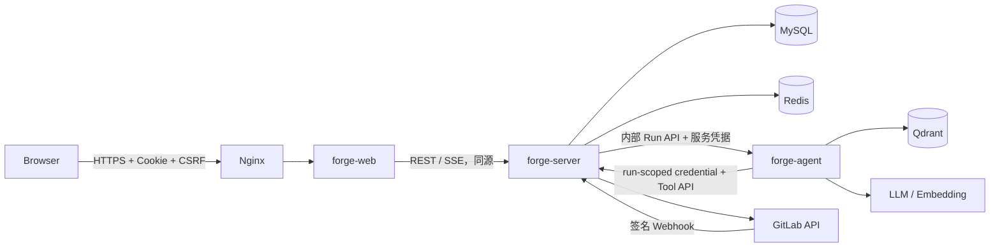
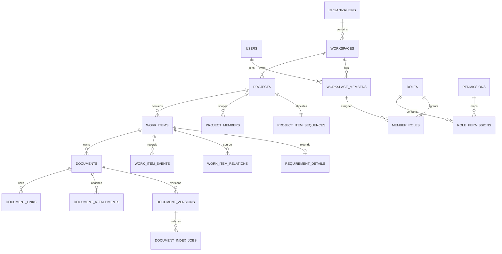
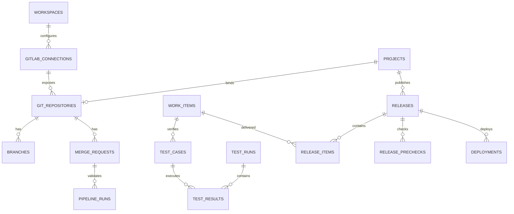
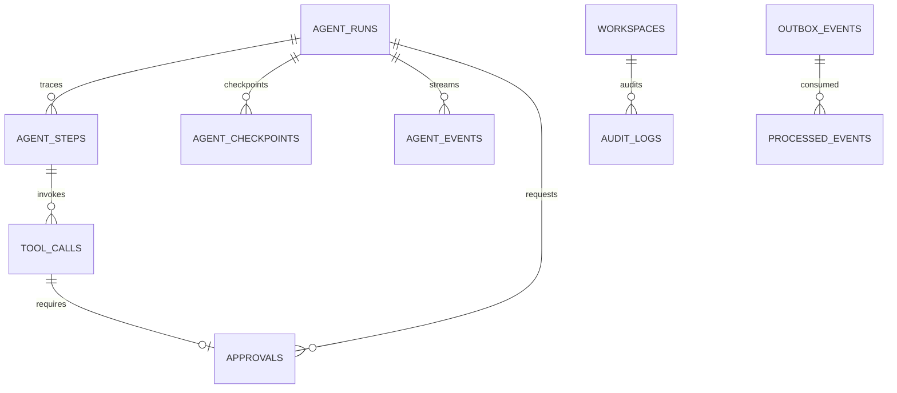
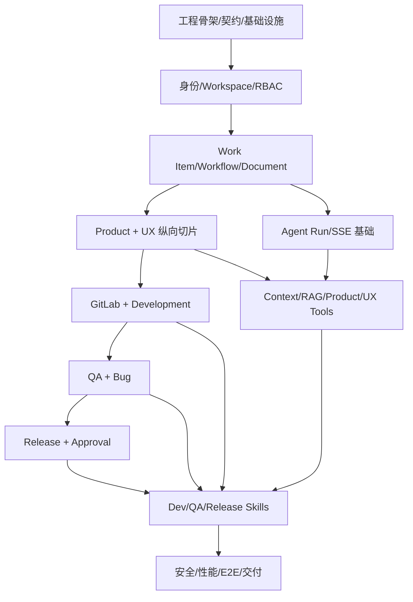

# ForgeAI 详细设计 v1.0

> 面向 MVP 实施、代码评审、测试验收和面试讲解的工程级设计基线

| 属性 | 内容 |
|---|---|
| 文档状态 | 可进入分阶段开发 |
| 版本 | v1.0 |
| 日期 | 2026-08-25 |
| 上游基线 | `ForgeAI_PRD_v0.2.md`、`ForgeAI_完整技术方案_v1.3.md` |
| 配套实施文档 | `docs/development/ForgeAI_分阶段开发指南_v1.0.md` |
| 目标 | 把产品与技术方案收敛为可编码、可测试、可解释的详细契约 |

---

## 1. 文档边界与设计结论

本文件回答“每个模块具体如何实现、数据如何落库、状态如何变化、权限在哪里检查、失败如何恢复、接口如何协作”。它不重复 PRD 的市场定位，也不把框架示例当作最终代码。

### 1.1 不可突破的基线

1. `forge-server` 是业务事实与授权的唯一权威；Web、Agent 和 Webhook 都不能直接更新业务状态。
2. `forge-agent` 不连接业务 MySQL，不持有 GitLab Token、模型密钥或部署凭据。
3. MySQL 是事实来源；Redis 是可丢失的会话/短期状态；Qdrant 是可重建的派生索引。
4. 所有租户资源都必须同时具备 `workspace_id` 归属与服务端范围校验。
5. HIGH 风险动作必须审批；批准的是冻结后的具体 Tool 版本、参数和资源版本，而不是模糊意图。
6. MVP 采用模块化单体、固定工作流、REST + SSE、数据库 Outbox，不提前引入微服务、Kafka 或通用工作流引擎。
7. 研发采用纵向切片，每个切片同时包含领域规则、API、UI、测试和文档；具体节奏见配套开发指南。

### 1.2 本详细设计对上游方案的收敛

| 上游未完全展开项 | 本文结论 |
|---|---|
| Work Item 状态 | Requirement、Task、Bug、Release 使用四套明确状态机，不按 `type` 猜测状态含义 |
| 项目成员与项目角色 | `project_members` 决定访问范围；`member_roles.project_id` 决定项目内能力，两者职责不同 |
| Work Item 编号 | `project_item_sequences` 在事务中锁行分配，永不复用已删除编号 |
| 文档当前版本 | 创建不可变版本与切换 `current_version_id` 在同一事务完成；索引异步执行 |
| 异步协作 | 业务事务写 `outbox_events`；Worker 至少一次投递；消费者按事件 ID 幂等 |
| API 幂等 | `idempotency_records` 保存请求指纹和首次响应；相同 Key 不同请求返回冲突 |
| Agent 恢复 | Backend 保存业务 Trace/Event，Agent 保存运行 Checkpoint；恢复前重新鉴权和检查资源版本 |
| SSE 一致性 | MySQL 事件序号为准；Redis 仅做唤醒；重连使用 `Last-Event-ID` 补发 |
| Release | `releases` 是正式聚合，不再把 RELEASE 类型 Work Item 作为唯一事实；可选 Work Item 只用于看板追踪 |
| 附件存储 | MVP 使用 `BlobStorage` 接口，本地卷为默认实现，后续可替换 S3 兼容存储 |

### 1.3 需求追踪规则

- PRD 功能 ID 写入测试标签，例如 `@Requirement("WI-004")` 或 E2E 用例元数据。
- 每个公开 API 在 OpenAPI 描述中写 `x-permission`、`x-idempotent`、`x-audit-event`。
- 每个 Tool Contract 写明对应 Backend Endpoint、权限、风险级别和业务需求 ID。
- 影响基线的实现变更必须先新增 ADR，再同步本文件、OpenAPI、Tool Contract 和测试。

### 1.4 PRD 覆盖矩阵

| PRD 范围 | 详细设计落点 | 开发会话 | 最终证据 |
|---|---|---|---|
| AUTH/CFG | 4.2、6、14、17 | 06–10、23 | Session/CSRF/Secret/初始化安全测试 |
| ORG/PROJ | 4.2、4.3、6 | 09–10 | Workspace A/B 隔离矩阵 |
| WI/TASK | 4.4、5、7、8 | 11–12、14–17 | 状态机/并发/Delivery Graph E2E |
| DOC | 4.5、9.8、13.4、14.3 | 13、20 | 不可变版本、索引、跨租户检索测试 |
| UX | 5.2、13.2 | 15–17、21–22 | Product→UX 人工与 Agent 两条链 |
| GIT | 4.6、11 | 23–27 | Stub Contract、Webhook/幂等/CI Guard |
| QA | 4.7、12.1、16 | 28–29 | QA 失败回流与 Bug 回归 E2E |
| REL | 4.7、5.3、12 | 30–31 | Precheck/审批/模拟部署负向测试 |
| Agent | 4.8、8.4、9、10 | 18–22、27、29–31 | Tool/Trace/SSE/Approval/Eval |
| 安全/非功能 | 3、14–18 | 全阶段，集中在 33–34 | 威胁测试、故障演练、性能与恢复报告 |

---

## 2. 总体运行结构

### 2.1 容器与信任边界



上图为腾讯云最终上线时的信任边界。本地开发使用相同服务名和网络关系的 Docker Desktop Compose；Browser 通过 `http://localhost:<port>` 访问本机入口，MySQL、Redis、Qdrant 均为本机容器，不连接 VM。

信任级别从高到低为：Backend 领域规则与数据库约束、Backend 身份与授权上下文、受签名的内部调用、外部系统响应、模型输出与用户文档。模型输出和文档内容始终是不可信输入。

### 2.2 三应用职责

| 应用 | 可以做 | 不可以做 |
|---|---|---|
| `forge-web` | 展示、输入校验、Query 缓存、SSE reducer、发起审批 | 依据隐藏按钮完成授权；直连 Agent/GitLab/数据设施 |
| `forge-server` | 认证、授权、事务、状态机、审批、审计、外部适配 | 把业务决策交给模型；跨模块绕过应用服务访问 Repository |
| `forge-agent` | 构建最小上下文、检索、计划、选择 Tool、解释结构化结果 | 直接写业务库；自报权限；读取明文 Secret；把模型猜测当执行结果 |

### 2.3 典型写操作链路

1. Controller 解析请求并建立 `RequestContext(requestId, userId, workspaceId)`。
2. Application Service 校验成员范围和权限，不接受前端传入的角色作为依据。
3. 读取聚合并校验 `expectedVersion`、业务不变量和工作流准入条件。
4. 同一事务写业务表、领域事件/活动、审计日志与 Outbox。
5. 事务提交后返回 DTO；异步副作用由 Worker 消费 Outbox。
6. 所有跨模块写入通过目标模块的应用服务；查询通过公开 Query Service。

### 2.4 模块依赖方向

```text
controller/infrastructure -> application -> domain
repository implementation -> repository port <- application

auth/common <- workspace <- project <- workitem/document
project/workitem/document <- gitlab, qa, release, agent
audit/outbox 被所有模块调用，但不反向依赖业务模块
```

禁止形成 `workitem -> qa -> workitem` 这样的代码循环。跨模块引用只保存对方 ID；需要组合视图时由应用层 Query Facade 组装。

---

## 3. 通用工程约定

### 3.1 标识、时间与命名

| 项目 | 约定 |
|---|---|
| 业务主键 | MySQL `BIGINT UNSIGNED`，应用使用 `long`；不暴露可推断 ID 作为唯一授权依据 |
| 外部运行 ID | Agent Run/Tool/Approval/Event 使用带前缀 ULID 字符串，如 `ar_01...`、`tc_01...` |
| 时间 | DB 使用 `DATETIME(6)` UTC；API 使用 ISO-8601 UTC；Web 按用户时区显示 |
| 枚举 | DB 使用 `VARCHAR` + 应用枚举，避免 MySQL ENUM 影响迁移 |
| 金额/成本 | 模型成本用 `DECIMAL(18,8)`，禁止浮点 |
| JSON | 只用于策略、快照、外部原始摘要；可查询的核心字段必须规范化 |
| 逻辑删除 | 用户内容允许 `deleted_at`；审计、事件、版本和审批不允许普通逻辑删除 |
| 版本 | 可并发修改聚合统一 `version BIGINT NOT NULL DEFAULT 0` |

Java 持久化建议使用 Spring Data JDBC/JPA 均可，但领域层不暴露 ORM Entity。首轮实现若选 JPA，应显式控制关联加载，禁止在聚合间建立级联 `@ManyToMany`。

#### 3.1.1 注释与 Java 成员规则

所有项目中的解释性注释优先使用中文；标识符、协议名、第三方字段和面向外部的英文产品文案保持原样。除生成源码外，Java 生产代码中的**所有成员字段、record 组件、enum 常量及 enum 成员字段**都必须分别使用紧邻声明的中文普通块注释（`/* ... */`）说明业务语义，不使用 Javadoc（`/** ... */`）；这项代码注释规则与 Swagger 独立。方法参数和局部变量不要求机械地逐一注释。

| 字段类别 | 注释必须说明 |
|---|---|
| ID/外部 ID | 本地或远端来源、不可变性/关联对象 |
| `workspaceId/projectId` | 租户/项目范围与授权用途 |
| enum/status | 合法值由何处定义、状态语义 |
| Secret/密文/hash | 不可回显、加密或校验边界 |
| 时间/金额/计数 | 时区、单位、精度或生命周期 |
| `version` | 乐观锁和 `expectedVersion` 的关系 |
| 删除字段 | 逻辑删除行为和是否可恢复 |
| record 组件 | 在请求、响应、命令、查询或事件中的数据含义 |
| enum 常量 | 单个状态/类型的业务含义、可执行行为或持久化兼容性 |
| 常量/日志对象 | 在当前类型中的用途和作用范围 |

代码风格规则：不写“工作区 ID”这类字段名复述，写“所属工作区，用于服务端租户隔离查询，禁止由客户端直接信任”；enum 每个常量单独注释，不用一条注释覆盖多项；不在注释内放会过期的实现细节。CI 使用自定义 Checkstyle AST 规则或 JavaParser 校验任务验证字段、record 组件和 enum 常量存在含中文字符的普通块注释；生成源码排除。`JavadocVariable` 不适用于本规则。规则未完成前，相关 Java 类型评审为阻断项。

### 3.2 请求、错误与分页

成功响应直接返回资源 DTO；创建返回 `201 + Location`，异步任务返回 `202`。错误统一为：

```json
{
  "code": "WORKFLOW_GUARD_FAILED",
  "message": "UX review is required before development",
  "requestId": "req_01K...",
  "details": {
    "action": "APPROVE_UX_REVIEW",
    "missing": ["PUBLISHED_UX_SPEC", "UX_REVIEW_APPROVAL"]
  }
}
```

核心错误码：`UNAUTHENTICATED`、`FORBIDDEN`、`RESOURCE_NOT_FOUND`、`TENANT_SCOPE_MISMATCH`、`VALIDATION_FAILED`、`VERSION_CONFLICT`、`IDEMPOTENCY_CONFLICT`、`WORKFLOW_ACTION_NOT_ALLOWED`、`WORKFLOW_GUARD_FAILED`、`APPROVAL_REQUIRED`、`APPROVAL_EXPIRED`、`EXTERNAL_SERVICE_ERROR`、`RATE_LIMITED`。

列表请求使用 `page`（从 1 开始）、`pageSize`（默认 20，最大 100）、`sort`；Agent Event 和 Audit Log 使用游标/sequence。任何筛选字段都必须有白名单，不能把前端字段直接拼成 SQL。

### 3.3 幂等设计

以下写操作强制 `Idempotency-Key`：Agent 创建资源、GitLab 写操作、Pipeline 触发、Webhook 接收、Release Deploy、所有内部 Tool API。普通人工 CRUD 推荐支持。

`idempotency_records` 保存：`scope_type`、`scope_id`、`idempotency_key`、`request_hash`、`status`、`response_status`、`response_body`、`resource_type/id`、`expires_at`。唯一键为 `(scope_type, scope_id, idempotency_key)`。

- 首次请求插入 `PROCESSING`；完成后保存稳定响应。
- 同 Key + 同请求指纹：完成时重放首次响应，处理中返回 `409 IDEMPOTENCY_IN_PROGRESS`。
- 同 Key + 不同指纹：返回 `409 IDEMPOTENCY_CONFLICT`。
- HIGH 操作的幂等记录至少保留 90 天；普通 Tool 至少 7 天。

### 3.4 事务、事件与一致性

- 一个聚合的一次命令只使用一个本地数据库事务。
- 业务表、`work_item_events`/活动、`audit_logs`、`outbox_events` 在同一事务落库。
- 外部 GitLab、Qdrant、LLM 调用不得放在持有数据库行锁的事务中。
- Worker 使用 `SELECT ... FOR UPDATE SKIP LOCKED` 领取 Outbox；失败指数退避并记录最后错误。
- 消费者使用 `(consumer_name, event_id)` 或目标表唯一键保证幂等。
- 跨系统只承诺最终一致；UI 展示 `syncStatus` 和 `lastSyncedAt`，不伪装成强一致。

### 3.5 Secret 与日志

Secret 使用 AES-256-GCM 信封加密，数据密钥由实例主密钥派生/包装；表内保存 `ciphertext`、`iv`、`key_version`，主密钥只从部署 Secret 注入。所有日志通过字段级脱敏器处理 `authorization`、`cookie`、`token`、`apiKey`、`password`、Tool 敏感参数和文档正文。

---

## 4. 数据模型详细设计

### 4.1 数据库与迁移规则

- MySQL 8，字符集 `utf8mb4`，排序规则 `utf8mb4_0900_ai_ci`。
- Flyway 迁移只前进，不修改已发布脚本。基础表按领域拆成 V1–V8，而不是一个不可评审的超大 SQL。
- 自编写的建表迁移必须为表和每个字段分别声明中文 `COMMENT`，说明业务语义、范围、空值含义或约束；新增/修改字段的后续迁移必须同步维护字段注释。SQL 行注释不能替代写入 MySQL 元数据的 `COMMENT`。
- 外键用于同模块强关系；跨模块高频演进关系可只加索引并由应用校验。所有租户子表都保留 `workspace_id`，即使可从父表推导，以便隔离查询和防御性校验。
- 生产迁移避免长事务和直接删除列；采用 expand → migrate → contract。

建议迁移顺序：

| Migration | 建表范围 |
|---|---|
| V1 `identity_workspace` | `instance_settings,users,organizations,workspaces,workspace_members` |
| V2 `project_rbac` | `projects,project_item_sequences,project_members,project_policies,roles,permissions,role_permissions,member_roles` + 默认权限种子 |
| V3 `work_item_workflow` | `work_items,requirement_details,work_item_relations,work_item_events,comments,review_records` |
| V4 `document_storage` | `documents,document_versions,document_attachments,document_links,document_index_jobs` |
| V5 `secrets_gitlab_model` | `secrets,model_configs,gitlab_connections,git_repositories,branches,merge_requests,pipeline_runs,webhook_deliveries` |
| V6 `qa_release` | `test_cases,test_runs,test_results,bug_details,releases,release_items,release_prechecks,deployments` |
| V7 `agent_approval_audit` | `agent_runs,agent_steps,tool_calls,agent_checkpoints,agent_events,approvals,audit_logs` |
| V8 `outbox_idempotency` | `outbox_events,processed_events,idempotency_records` + Worker 索引 |

#### 4.1.1 逻辑 ERD

ERD 按信任和演进边界拆成三张图；字段级定义以下方数据字典为准。







### 4.2 身份、组织与项目

| 表 | 关键列 | 约束与索引 |
|---|---|---|
| `instance_settings` | `id(singleton),initialized_at,default_organization_id,settings_json,version` | CHECK/应用约束只允许单行；初始化时锁定 |
| `users` | `id,email,normalized_email,display_name,password_hash,status,failed_login_count,locked_until,last_login_at,created_at,updated_at,version` | UQ `normalized_email`; IDX `status` |
| `organizations` | `id,name,slug,owner_user_id,created_at,updated_at,version` | UQ `slug`; FK owner |
| `workspaces` | `id,organization_id,name,slug,status,settings_json,created_at,updated_at,version` | UQ `(organization_id,slug)` |
| `workspace_members` | `id,workspace_id,user_id,status,joined_at,created_at,updated_at,version` | UQ `(workspace_id,user_id)`; IDX `(user_id,status)` |
| `projects` | `id,workspace_id,item_sequence_id,key,name,description,status,created_by,created_at,updated_at,archived_at,version` | UQ `(workspace_id,key)`; IDX `(workspace_id,status)` |
| `project_item_sequences` | `id,project_id,next_value,version` | UQ `project_id`; 分配编号时锁行 |
| `project_members` | `id,workspace_id,project_id,user_id,status,created_at` | UQ `(project_id,user_id)`; 用户须先是 Workspace Member |
| `project_policies` | `project_id,workspace_id,ux_required,allow_ux_skip,ci_required,required_pipeline_status,medium_tool_confirmation,release_approval_ttl_minutes,settings_json,version` | PK `project_id` |
| `model_configs` | `id,workspace_id NULL,purpose,provider,endpoint,model_name,credential_secret_id,status,settings_json,created_at,updated_at,version` | UQ `(workspace_id,purpose,status)` 由应用保证仅一个 ACTIVE；Secret 不随 DTO 返回 |

首个 Admin 初始化由数据库唯一事实 `instance_settings.initialized_at` 控制，而不是“查询 users 是否为空”。初始化端点在同一事务创建用户、Organization、Workspace、Owner 角色并设置 initialized；唯一锁保证并发只成功一次。

### 4.3 RBAC

| 表 | 关键列 | 约束 |
|---|---|---|
| `roles` | `id,workspace_id NULL,code,name,system_role,description` | 系统角色 UQ `(code,system_role)`；自定义角色 UQ `(workspace_id,code)` |
| `permissions` | `id,code,resource,action,description` | UQ `code` |
| `role_permissions` | `role_id,permission_id` | PK `(role_id,permission_id)` |
| `member_roles` | `id,workspace_member_id,role_id,project_id NULL,created_at` | UQ `(workspace_member_id,role_id,project_id)` |

授权算法：先验证资源 `workspace_id`；再验证 Workspace Membership；项目资源还需 Owner/Admin 或有效 `project_members`；最后合并 Workspace 级与当前 Project 级角色权限。拒绝默认优先，MVP 不支持显式 Deny。

### 4.4 Work Item 与活动

| 表 | 关键列 | 约束与索引 |
|---|---|---|
| `work_items` | `id,workspace_id,project_id,item_number,item_key,type,title,description,status,priority,parent_id,assignee_user_id,reporter_user_id,due_at,severity,blocked_at,blocked_reason,blocked_by,created_at,updated_at,deleted_at,version` | UQ `(project_id,item_number)`、`(project_id,item_key)`；IDX `(project_id,type,status)`、`(workspace_id,assignee_user_id,status)` |
| `requirement_details` | `work_item_id,workspace_id,goal,in_scope,out_of_scope,acceptance_criteria_json,business_value` | PK `work_item_id` 且 Work Item type=REQUIREMENT；Guard 使用结构化字段 |
| `work_item_relations` | `id,workspace_id,project_id,source_id,target_id,relation_type,created_by,created_at` | UQ `(source_id,target_id,relation_type)`；禁止 self relation |
| `work_item_events` | `id,workspace_id,project_id,work_item_id,event_type,from_status,to_status,actor_type,actor_id,reason,metadata_json,created_at` | IDX `(work_item_id,id)`；追加写 |
| `comments` | `id,workspace_id,project_id,work_item_id,author_user_id,body,created_at,updated_at,deleted_at,version` | IDX `(work_item_id,created_at)` |
| `review_records` | `id,workspace_id,project_id,work_item_id,review_type,status,reviewer_user_id,comment,checklist_json,artifact_version_json,created_at` | IDX `(work_item_id,review_type,status)`；提交 UX Review 时 checklist 固化 |

编号分配：在创建 Work Item 的事务内锁定 `project_item_sequences`，取 `next_value`，立即递增并形成 `${project.key}-${number}`。编号缺口允许存在，禁止为追求连续而复用。

关系约束：两端必须属于相同 Workspace；MVP 要求同 Project，跨项目关系推迟。`parent_id` 只表达树状从属；其他语义使用 Relation。Delivery Graph 查询从 Requirement 出发，限制最大深度 8、最大节点 500，并在响应中标记截断。

### 4.5 文档、附件与索引

| 表 | 关键列 | 约束与索引 |
|---|---|---|
| `documents` | `id,workspace_id,project_id,work_item_id NULL,type,title,status,visibility,current_version_id NULL,created_by,created_at,updated_at,deleted_at,version` | IDX `(project_id,type,status)`、`(work_item_id,type)` |
| `document_versions` | `id,workspace_id,document_id,version_no,content_format,content,content_hash,summary,created_by,created_at` | UQ `(document_id,version_no)`；不可变 |
| `document_attachments` | `id,workspace_id,document_id,version_id NULL,file_name,storage_key,mime_type,size_bytes,checksum,status,created_by,created_at` | UQ `storage_key`; 限制类型与大小 |
| `document_links` | `id,workspace_id,document_id,version_id NULL,link_type,title,url,url_hash,created_by,created_at` | IDX `(document_id,link_type)`；访问时显示外部链接警告，不由 Agent 自动抓取 |
| `document_index_jobs` | `id,workspace_id,project_id,document_id,version_id,status,attempts,next_attempt_at,chunk_count,error_code,error_message,indexed_at,created_at,updated_at` | UQ `(document_id,version_id)` |

文档状态为 `DRAFT/PUBLISHED/ARCHIVED`。保存草稿也创建不可变版本；发布将指定版本设为 current，并写 `DOCUMENT_VERSION_PUBLISHED` Outbox。编辑器保存 ProseMirror JSON，服务端同时生成规范化纯文本供搜索、摘要和哈希使用。

索引块稳定 ID：`doc:{documentId}:ver:{versionId}:chunk:{chunkIndex}`。切块优先按标题/段落，目标 600–900 tokens，重叠 80–120 tokens；代码块和表格尽量不截断。Qdrant Collection 通过 embedding 模型版本命名；切换模型采用新 Collection 重建后原子切换别名。

### 4.6 GitLab 与 CI

| 表 | 关键列 | 约束与索引 |
|---|---|---|
| `gitlab_connections` | `id,workspace_id,name,base_url,credential_secret_id,webhook_secret_id,status,last_tested_at,created_by,version` | UQ `(workspace_id,name)` |
| `secrets` | `id,workspace_id,type,ciphertext,iv,key_version,fingerprint,created_at,rotated_at` | 禁止普通读取 API |
| `git_repositories` | `id,workspace_id,project_id,connection_id,remote_project_id,path_with_namespace,http_url,default_branch,status,last_synced_at,version` | UQ `(connection_id,remote_project_id)`；一个 Project MVP 绑定一个 active repo |
| `branches` | `id,workspace_id,repository_id,work_item_id NULL,name,commit_sha,status,remote_updated_at,last_synced_at` | UQ `(repository_id,name)` |
| `merge_requests` | `id,workspace_id,repository_id,work_item_id NULL,remote_mr_iid,title,source_branch,target_branch,state,web_url,author_external_id,head_sha,merge_status,remote_updated_at,last_synced_at,version` | UQ `(repository_id,remote_mr_iid)` |
| `pipeline_runs` | `id,workspace_id,repository_id,merge_request_id NULL,remote_pipeline_id,ref,commit_sha,status,web_url,started_at,finished_at,last_synced_at,summary_json` | UQ `(repository_id,remote_pipeline_id)` |
| `webhook_deliveries` | `id,workspace_id,connection_id,delivery_key,event_type,payload_hash,status,attempts,error_message,received_at,processed_at` | UQ `(connection_id,delivery_key)` |

GitLab 原始 payload 只在调试策略允许时短期保存并脱敏；正常表仅保存标准化字段。远端状态覆盖本地缓存，但不会自动跨越 ForgeAI 工作流 Guard。

### 4.7 QA 与 Release

| 表 | 关键列 | 约束与索引 |
|---|---|---|
| `test_cases` | `id,workspace_id,project_id,work_item_id,title,preconditions,steps_json,expected_result,priority,status,created_by,version` | IDX `(work_item_id,status)` |
| `test_runs` | `id,workspace_id,project_id,requirement_id,environment,status,started_by,started_at,finished_at,summary_json,version` | IDX `(requirement_id,status)` |
| `test_results` | `id,workspace_id,test_run_id,test_case_id,status,actual_result,evidence_json,executed_by,executed_at,version` | UQ `(test_run_id,test_case_id)` |
| `bug_details` | `work_item_id,workspace_id,severity,reproduction_steps,environment,found_in_version,fixed_in_version` | PK `work_item_id` 且 Work Item type=BUG |
| `releases` | `id,workspace_id,project_id,version_name,environment,status,release_note_document_id NULL,policy_snapshot_json,created_by,created_at,updated_at,version` | UQ `(project_id,version_name,environment)` |
| `release_items` | `release_id,work_item_id,workspace_id` | PK `(release_id,work_item_id)` |
| `release_prechecks` | `id,workspace_id,release_id,status,checks_json,checked_at,checked_by_type,checked_by_id,resource_versions_json` | IDX `(release_id,checked_at)` |
| `deployments` | `id,workspace_id,release_id,environment,status,pipeline_run_id NULL,approval_id,mode,started_at,finished_at,result_json,rollback_of_id NULL,version` | IDX `(release_id,status)` |

Precheck 是一次不可变快照，不直接等于“永远可发布”。真正执行 Deploy 前重新验证审批未过期、Release version 未变化、最新 Precheck 与关键资源版本一致。

### 4.8 Agent、审批、审计与可靠性

| 表 | 关键列 | 约束与索引 |
|---|---|---|
| `agent_runs` | `id(ULID),workspace_id,project_id,work_item_id NULL,user_id,skill,message_redacted,status,model_provider,model_name,prompt_version,started_at,finished_at,token_input,token_output,cost,error_code,version` | IDX `(project_id,created_at)`、`(user_id,status)` |
| `agent_steps` | `id,run_id,step_no,type,name,status,input_summary,output_summary,error_code,started_at,finished_at` | UQ `(run_id,step_no)` |
| `tool_calls` | `id(ULID),run_id,step_id,tool_name,tool_version,risk_level,status,required_permission,argument_hash,arguments_redacted,result_summary,idempotency_key,approval_id NULL,started_at,finished_at` | UQ `(run_id,idempotency_key)` |
| `agent_checkpoints` | `id,run_id,node_name,state_version,checkpoint_ref,state_hash,created_at` | UQ `(run_id,state_version)` |
| `agent_events` | `id,run_id,sequence,event_type,payload_json,created_at` | UQ `(run_id,sequence)` |
| `approvals` | `id(ULID),workspace_id,project_id,run_id NULL,tool_call_id NULL,type,risk_level,status,requested_by,approver_user_id NULL,tool_name,tool_version,argument_hash,frozen_arguments_encrypted,resource_versions_json,reason,expires_at,decided_at,version` | IDX `(project_id,status,expires_at)` |
| `audit_logs` | `id,workspace_id,project_id NULL,actor_type,actor_id,action,resource_type,resource_id,result,request_id,run_id NULL,metadata_redacted_json,created_at` | IDX `(workspace_id,created_at)`、`(resource_type,resource_id)`；追加写 |
| `outbox_events` | `id(ULID),workspace_id NULL,aggregate_type,aggregate_id,event_type,payload_json,status,attempts,next_attempt_at,locked_by,locked_at,processed_at,created_at` | IDX `(status,next_attempt_at)` |
| `processed_events` | `consumer_name,event_id,processed_at` | PK `(consumer_name,event_id)` |
| `idempotency_records` | 见 3.3 | UQ scope + key |

Agent Event payload 只保存 UI 恢复所需结构化数据，不保存完整隐式推理。模型消息、检索片段和 Tool 参数遵循部署方 Trace 保留策略，默认只留脱敏摘要和来源 ID。

---

## 5. 状态机详细设计

### 5.1 状态机分型

`work_items.type` 决定使用哪个状态集合，Backend 创建时写入初始状态，之后只接受 Action，不接受任意目标状态。

| 类型 | 状态集合 |
|---|---|
| `REQUIREMENT` | `DRAFT, PRODUCT_REVIEW, UX_IN_PROGRESS, UX_REVIEW, READY_FOR_DEV, IN_DEVELOPMENT, READY_FOR_QA, IN_QA, READY_FOR_RELEASE, RELEASED, DONE, REJECTED, CANCELLED`，另有 `blocked` 属性通过事件表达 |
| `UX_TASK/DEV_TASK/QA_TASK` | `TODO, IN_PROGRESS, IN_REVIEW, DONE, BLOCKED, CANCELLED` |
| `BUG` | `OPEN, IN_PROGRESS, RESOLVED, VERIFIED, CLOSED, REOPENED, CANCELLED` |
| Release 聚合 | `DRAFT, PRECHECK_FAILED, READY_FOR_APPROVAL, APPROVED, DEPLOYING, RELEASED, FAILED, CANCELLED` |

RELEASE 类型 Work Item 若保留，仅作为 Release 聚合的看板代理，状态由 Release 应用服务投影，不允许独立修改。Requirement 的阻塞是与主生命周期正交的 `blocked_at/reason/by`；`BLOCK/UNBLOCK` 不改变主状态，但会增加 version 并写事件，处于阻塞时除 UNBLOCK/CANCEL 外拒绝阶段推进。

### 5.2 Requirement 动作与 Guard

| Action | From → To | 权限 | Guard/副作用 |
|---|---|---|---|
| `SUBMIT_PRODUCT_REVIEW` | DRAFT → PRODUCT_REVIEW | `requirement.edit` | `requirement_details` 的目标、范围、验收标准存在；写评审记录 |
| `APPROVE_PRODUCT_REVIEW` | PRODUCT_REVIEW → UX_IN_PROGRESS | `requirement.review` | 已发布 PRD；创建/确认 UX Task |
| `REJECT_PRODUCT_REVIEW` | PRODUCT_REVIEW → DRAFT | `requirement.review` | reason 必填 |
| `SUBMIT_UX_REVIEW` | UX_IN_PROGRESS → UX_REVIEW | `ux.edit` | 已发布 UX Spec；提交的 checklist 中用户流、页面清单、关键交互、异常态均确认并固化 |
| `APPROVE_UX_REVIEW` | UX_REVIEW → READY_FOR_DEV | `ux.review` | review PASS；记录交付物版本快照 |
| `REJECT_UX_REVIEW` | UX_REVIEW → UX_IN_PROGRESS | `ux.review` | reason 必填 |
| `SKIP_UX` | PRODUCT_REVIEW → READY_FOR_DEV | `ux.skip` | policy 允许、reason 必填、只允许纯后端/运维标签，审计 |
| `START_DEVELOPMENT` | READY_FOR_DEV → IN_DEVELOPMENT | `development.start` | 至少一个 Dev Task；负责人存在 |
| `SUBMIT_FOR_QA` | IN_DEVELOPMENT → READY_FOR_QA | `development.submit` | Dev Task 完成；若策略要求则 MR 存在且 Pipeline 成功 |
| `START_QA` | READY_FOR_QA → IN_QA | `test.execute` | Test Run 已创建且包含用例 |
| `QA_FAIL` | IN_QA → IN_DEVELOPMENT | `test.execute` | 有 FAIL/BLOCKED 结果或阻断 Bug；reason 必填 |
| `QA_PASS` | IN_QA → READY_FOR_RELEASE | `test.execute` | Test Run 完成；无 OPEN/REOPENED 阻断 Bug |
| `MARK_RELEASED` | READY_FOR_RELEASE → RELEASED | `release.deploy` | Release 已 RELEASED；有效审批和成功 Deployment |
| `CLOSE_REQUIREMENT` | RELEASED → DONE | `requirement.close` | Release Note 可访问，交付图无未完成阻断项 |
| `CANCEL` | 非终态 → CANCELLED | `requirement.cancel` | reason 必填；不能隐式删除关联资产 |

Guard 返回机器可读 `missing[]`，UI 展示如何满足，而不只显示“操作失败”。同一个 Action 使用 `(workItemId, expectedVersion, idempotencyKey)` 防并发和重复。

### 5.3 Task、Bug 与 Release 动作

Task：`START`、`SUBMIT_REVIEW`、`APPROVE`、`REJECT`、`BLOCK`、`UNBLOCK`、`CANCEL`。只有 UX Task 强制 `IN_REVIEW` 后才能 DONE；项目策略可要求 Dev/QA Task 评审。

Bug：`START_FIX`、`RESOLVE`、`VERIFY`、`CLOSE`、`REOPEN`、`CANCEL`。`RESOLVE` 需要修复说明和关联 MR/Commit（项目无仓库时允许审计理由）；`VERIFY` 必须由 QA 或 Admin 执行；严重级别 `BLOCKER/CRITICAL` 未 VERIFIED/CLOSED 时阻断 Release。

Release：

```text
DRAFT --RUN_PRECHECK(pass)--> READY_FOR_APPROVAL
DRAFT --RUN_PRECHECK(fail)--> PRECHECK_FAILED
PRECHECK_FAILED --RUN_PRECHECK(pass)--> READY_FOR_APPROVAL
READY_FOR_APPROVAL --REQUEST/APPROVE--> APPROVED
APPROVED --DEPLOY--> DEPLOYING
DEPLOYING --SUCCESS--> RELEASED
DEPLOYING --FAIL--> FAILED
```

审批拒绝回到 `READY_FOR_APPROVAL` 并保存拒绝记录；过期审批不能执行。重新 Precheck、Release 版本变化或冻结资源版本变化使已有批准失效。

### 5.4 Workflow 实现结构

```java
public interface TransitionGuard {
    GuardResult evaluate(TransitionContext context);
}

public record TransitionDefinition(
    /* 应用该转换定义的工作项类型。 */
    WorkItemType type,
    /* 执行动作前要求的工作项状态。 */
    WorkItemStatus from,
    /* 用户或 Agent 请求执行的工作流动作。 */
    WorkflowAction action,
    /* 动作成功后进入的工作项状态。 */
    WorkItemStatus to,
    /* 执行该动作所需的服务端权限编码。 */
    String requiredPermission,
    /* 状态更新前必须全部通过的确定性准入规则。 */
    List<TransitionGuard> guards
) {}
```

定义在代码中注册并由启动测试检查：每个 Action 唯一、终态无非预期出口、所有目标状态可达、权限非空。业务查询由 Guard 使用只读端口完成；Guard 不产生副作用。状态写入成功后再由应用服务创建评审记录/Outbox。

---

## 6. RBAC 与服务端授权点

### 6.1 默认权限

权限使用 `resource.action`：

```text
workspace.read/manage, member.read/manage, project.read/manage,
requirement.read/create/edit/review/close/cancel,
ux.read/create/edit/review/skip,
task.read/create/assign/edit,
development.start/submit,
document.read/create/edit/publish/archive,
repo.read/branch.create/mr.create,
pipeline.read/trigger,
test.read/create/execute,
bug.read/create/edit/verify,
release.read/create/precheck/approve/deploy/rollback,
agent.run/read/cancel, approval.read/decide, audit.read,
integration.read/manage, model_config.manage
```

### 6.2 默认角色矩阵

| 能力组 | Owner/Admin | Product | UX | Developer | QA | Release Approver |
|---|:---:|:---:|:---:|:---:|:---:|:---:|
| Workspace/成员/集成管理 | ✓ | — | — | — | — | — |
| Requirement 创建编辑/产品评审 | ✓ | ✓ | 读 | 读 | 读 | 读 |
| UX 创建编辑/评审 | ✓ | 评审 | ✓ | 读 | 读 | 读 |
| Dev Task/Branch/MR/Pipeline | ✓ | 读 | 读 | ✓ | Pipeline 读 | 读 |
| Test/结果/Bug | ✓ | 读 | 读 | Bug 处理 | ✓ | 读 |
| Release 创建/预检 | ✓ | 读 | 读 | 读 | 读 | ✓ |
| Release 审批 | Owner 可按策略 | — | — | — | — | ✓ |
| 审计/配置 | ✓ | — | — | — | — | — |

Owner 默认拥有全部权限但仍受 HIGH 审批规则约束；发起 HIGH Tool 的同一用户默认不能审批自己的请求，单人 Workspace 可通过显式 `allowSelfApprovalForSingleMember=true` 的实例策略放宽，并在 Demo 中清楚说明风险。

### 6.3 授权检查顺序

1. Session/内部凭据有效。
2. 资源存在；对无权用户统一返回 404，减少 ID 枚举。
3. 资源的 `workspace_id/project_id` 与 URL/Run Context 一致。
4. 成员和 Project 访问范围有效。
5. 角色包含所需权限。
6. Project Policy、资源状态和风险策略允许。
7. Agent Tool 额外检查 Skill Allowlist、Run 主体当前权限和审批。

Controller 使用声明式注解只做粗粒度入口保护；Application Service 在加载资源后做最终授权。Repository 查询必须要求 scope 参数，例如 `findByIdAndWorkspaceId`，禁止无租户条件的业务查询方法。

---

## 7. Backend 模块详细设计

### 7.0 持久化实现约定

- MySQL 访问统一采用 MyBatis 体系。简单单表 CRUD 优先 MyBatis-Plus；包含租户范围、多表聚合、悲观锁或性能敏感 SQL 的 Store 使用 `@Mapper` 中显式、可审查的 MyBatis SQL。
- Application Service 仅依赖领域 Store 端口，不依赖 Mapper、MyBatis-Plus 或具体 SQL 技术细节。
- 不新增 `JdbcTemplate` 生产 Store。无论采用何种 Mapper 方式，业务查询仍必须显式传入并在 SQL 中限制 `workspace_id`、`project_id` 等 scope；ORM 不能替代租户过滤。

### 7.1 模块公开面

| 模块 | Command Service | Query Service | 主要领域事件 |
|---|---|---|---|
| auth | `AuthenticationService`, `InstanceBootstrapService` | `CurrentUserQuery` | UserLoggedIn, SessionRevoked |
| workspace | `WorkspaceCommandService`, `MemberCommandService` | `WorkspaceQueryService` | MemberRoleChanged |
| project | `ProjectCommandService`, `ProjectPolicyService` | `ProjectQueryService` | ProjectCreated, PolicyChanged |
| workitem | `WorkItemCommandService`, `WorkflowService`, `RelationService` | `WorkItemQueryService`, `DeliveryGraphQuery` | WorkItemCreated, WorkItemTransitioned |
| document | `DocumentCommandService`, `AttachmentService` | `DocumentQueryService` | DocumentVersionPublished |
| gitlab | `GitLabConnectionService`, `RepositoryService`, `GitLabWriteService`, `WebhookService` | `DevelopmentQueryService` | MrSynced, PipelineUpdated |
| qa | `TestCaseService`, `TestRunService`, `BugService` | `QualityQueryService` | TestRunCompleted, BlockingBugChanged |
| release | `ReleaseService`, `PrecheckService`, `DeploymentService` | `ReleaseQueryService` | ReleaseApproved, DeploymentCompleted |
| agent | `AgentRunService`, `ToolExecutionService`, `ApprovalService` | `AgentRunQueryService`, `AgentEventQuery` | AgentRunRequested, ApprovalDecided |
| audit/outbox | `AuditWriter`, `OutboxPublisher` | `AuditQueryService` | — |

### 7.2 后台任务

| Worker | 输入 | 行为 | 重试/死信 |
|---|---|---|---|
| Agent Dispatcher | `AGENT_RUN_REQUESTED` | 调用 Agent 内部启动 API | 3 次，之后 Run FAILED |
| Document Indexer | `DOCUMENT_VERSION_PUBLISHED` | 解析、Embedding、Qdrant upsert、校验 | 5 次，指数退避，人工重试 |
| GitLab Webhook Processor | webhook delivery | 标准化并 upsert MR/Pipeline | 5 次；原事件去重 |
| GitLab Reconciler | 定时任务 | 修复最近活跃仓库漏事件 | 每 5–15 分钟，带速率限制 |
| Approval Expirer | 定时任务 | 将过期 PENDING 标为 EXPIRED | 每分钟 |
| Retention Cleaner | 策略 | 清理过期幂等、临时附件、非关键 Trace | 小批量，审计 |

### 7.3 缓存原则

Redis 只缓存权限集合、短期连接状态和 SSE 唤醒信号。权限缓存键包含 `membershipVersion`，角色变更后递增版本并自然失效；授权失败不得因缓存故障变为允许。所有业务读取在缓存缺失时可回源 MySQL。

---

## 8. REST API 详细契约

### 8.1 通用 DTO

```ts
type ResourceRef = { type: string; id: string; key?: string; title?: string };
type Page<T> = { items: T[]; page: number; pageSize: number; total: number };
type Versioned = { version: number; createdAt: string; updatedAt: string };
type TransitionRequest = { action: string; expectedVersion: number; reason?: string };
```

所有路径中的 Workspace/Project slug 由 Web 路由使用，API 内部资源主要使用 ID；Backend 始终从资源再次解析 scope，不能信任仅由请求体提供的 `workspaceId`。

### 8.1.1 Swagger / OpenAPI 实现约定

`forge-server` 引入 `springdoc-openapi`，由运行中的 Spring MVC Controller 生成 OpenAPI 3；`/v3/api-docs` 是 CI 导出契约的来源，`/swagger-ui/index.html` 是开发/测试联调入口。禁用 Springfox。

- `Public API` 仅包含 `/api/v1/**`；`Internal Agent API` 单独分组并默认不在 Swagger UI 暴露。
- Swagger 注释仅允许写在 Controller：使用中文 `@Tag`、`@Operation`、`@Parameter`、`@ApiResponses` 和响应描述；不在 Entity 或 DTO 使用 Swagger 注解。
- 每个公开 API 描述包含权限、幂等键、`expectedVersion`、常见错误码；SSE 补充事件目录和 `Last-Event-ID`。
- Security Scheme 声明 Cookie Session 和 CSRF Header；Swagger 试调走真实认证/授权，不能创建旁路。
- 生产默认关闭 Swagger UI；若启用则仅 Owner/Admin 可访问并由 Nginx 限制。内部 API 永不对公网 Swagger 暴露。
- CI 导出 `openapi.json`，对比破坏性变更后生成 Web Client 与 Python DTO；禁止手改生成物。

### 8.2 P0 API 与授权

| Endpoint | 用途 | 权限/特殊约束 |
|---|---|---|
| `POST /api/v1/setup/initialize` | 首个 Admin 初始化 | 仅未初始化实例；全局唯一锁 |
| `POST /api/v1/auth/login/logout` | 登录退出 | 限流；登录后换 Session ID；写审计 |
| `GET /api/v1/me` | 当前用户、Workspace 与有效角色 | Session |
| `GET/POST /api/v1/workspaces` | 列表/创建 | read/manage |
| `GET/POST/PATCH /api/v1/projects` | 项目 CRUD | project.read/manage；PATCH version |
| `GET/POST /api/v1/projects/{id}/members` | 项目成员 | member.read/manage |
| `GET/POST/PATCH /api/v1/work-items` | 查询/创建/更新基础字段 | 按 type 映射权限；PATCH version |
| `POST /api/v1/work-items/{id}/transitions` | 状态动作 | Action 权限 + Guard + version + 幂等 |
| `POST/DELETE /api/v1/work-items/{id}/relations` | 关系 | task/edit 范围；防环/同租户 |
| `GET /api/v1/work-items/{id}/activity` | 活动时间线 | resource read |
| `GET /api/v1/work-items/{id}/delivery-graph` | 交付图 | requirement.read；节点逐一 scope |
| `GET/POST /api/v1/documents` | 查询/创建 | document.read/create |
| `POST /api/v1/documents/{id}/versions` | 新版本 | document.edit；version + 幂等 |
| `POST /api/v1/documents/{id}/publish` | 发布指定版本 | document.publish；触发索引 |
| `POST /api/v1/documents/{id}/attachments` | 上传 | MIME/大小/checksum；病毒扫描扩展点 |
| `POST /api/v1/gitlab/connections` | 保存连接 | integration.manage；Secret 不回显 |
| `POST /api/v1/gitlab/connections/{id}/test` | 连接测试 | integration.manage；SSRF 防护 |
| `POST /api/v1/gitlab/repositories/bind` | 绑定项目仓库 | project.manage + repo.read |
| `POST /api/v1/gitlab/branches` | 创建分支 | repo.branch.create；幂等；MEDIUM |
| `POST /api/v1/gitlab/merge-requests` | 创建 MR | repo.mr.create；幂等；MEDIUM |
| `POST /api/v1/gitlab/pipelines` | 触发 Pipeline | pipeline.trigger；幂等；MEDIUM |
| `POST /api/v1/gitlab/webhooks/{connectionId}` | GitLab 回调 | Secret/Token 校验；delivery 去重；快速 202 |
| `POST /api/v1/test-cases` | 创建用例 | test.create |
| `POST /api/v1/test-runs` | 创建 Run | test.execute；必须关联 Requirement |
| `PUT /api/v1/test-runs/{id}/results/{caseId}` | upsert 结果 | test.execute；version |
| `POST /api/v1/releases` | 创建 Release | release.create |
| `POST /api/v1/releases/{id}/prechecks` | 不可变预检 | release.precheck；幂等 |
| `POST /api/v1/releases/{id}/deployments` | 部署/模拟部署 | release.deploy；HIGH + Approval |
| `POST /api/v1/agent/runs` | 创建 Agent Run | agent.run；按 Skill 再校验 |
| `GET /api/v1/agent/runs/{id}/events` | SSE | agent.read；Run scope；Last-Event-ID |
| `POST /api/v1/approvals/{id}/approve|reject` | 决策 | approval.decide；version；不能越权自批 |

### 8.3 关键资源 DTO

`WorkItemResponse` 至少包含：`id,itemKey,type,title,description,status,priority,assignee,reporter,dueAt,severity,version,availableActions,guardHints,createdAt,updatedAt`。`availableActions` 只用于体验，执行时仍重新校验。

`DocumentResponse` 不默认返回所有版本正文；详情返回 current version，历史版本单独分页。附件下载使用短时授权 URL 或 Backend 流式代理，且每次下载重新校验权限。

`DeliveryGraphResponse`：

```json
{
  "root": "WORK_ITEM:1024",
  "nodes": [{"id":"WORK_ITEM:1024","type":"REQUIREMENT","label":"手机号登录","status":"IN_QA","url":"..."}],
  "edges": [{"source":"WORK_ITEM:1024","target":"DOCUMENT:88","type":"HAS_DOCUMENT"}],
  "truncated": false,
  "generatedAt": "2026-08-25T12:00:00Z"
}
```

### 8.4 内部 Agent API

Backend → Agent：

```text
POST /internal/v1/runs/{runId}/start
POST /internal/v1/runs/{runId}/resume
POST /internal/v1/runs/{runId}/cancel
GET  /internal/v1/health/ready
```

Agent → Backend：

```text
GET  /internal/v1/runs/{runId}/context
POST /internal/v1/runs/{runId}/events
POST /internal/v1/runs/{runId}/steps
POST /internal/v1/runs/{runId}/tool-calls
POST /internal/v1/tools/{toolName}:execute
```

内部请求使用 mTLS 或网络隔离 + 服务 JWT；Tool 调用额外携带短时 run-scoped credential、nonce 和 `X-Request-ID`。Credential 只标识上下文，不携带可直接信任的权限集合。

---

## 9. Agent Runtime 详细设计

### 9.1 Run 创建与调度

1. 用户提交 Skill、message、Project/Work Item scope 和 `clientRequestId`。
2. Backend 校验 `agent.run`、Skill 使用权和上下文资源，创建 `QUEUED` Run 与 `AGENT_RUN_REQUESTED` Outbox。
3. Dispatcher 签发 5 分钟 run-scoped credential，请求 Agent 启动；重复调度由 Agent 按 Run ID 幂等。
4. Agent 拉取 Backend 生成的 `ContextManifest`，而不是自行枚举资源。
5. Agent 建图执行并批量回写 Step/Event；Tool 必须回调 Backend。
6. Backend 是 Run 对外状态和 SSE 的权威；Agent Checkpoint 只是恢复材料。

### 9.2 ContextManifest

```json
{
  "runId": "ar_01K...",
  "subject": {"userId": 12},
  "scope": {"workspaceId": 2, "projectId": 10, "workItemId": 1024},
  "skill": "UX",
  "effectiveToolNames": ["get_work_item", "search_documents", "create_ux_task", "create_ux_document"],
  "policy": {"mediumConfirmation": "ASK", "maxToolCalls": 20, "tokenBudget": 50000},
  "resourceRefs": [{"type":"WORK_ITEM","id":"1024","version":7}],
  "expiresAt": "2026-08-25T12:05:00Z"
}
```

Manifest 不含明文 Secret，不把完整角色/权限交给模型。Tool 名称集合是运行入口时的上限，Backend 执行时按当前权限再次收紧。

### 9.3 Deep Agents 图节点

| 节点 | 输入 | 输出 | 失败处理 |
|---|---|---|---|
| `validate_context` | Run + Manifest | 有效 scope | 过期/撤权直接 FAILED |
| `build_context` | refs | 结构化当前资源 | 单个非关键资源失败可标记缺失 |
| `classify_intent` | message + Skill | intent/目标 | 不确定时生成澄清结果，不擅自扩大 scope |
| `create_plan` | intent + context | 可展示步骤 | 计划不等于授权 |
| `retrieve` | query + filters | 带引用 chunks | 无结果继续但声明依据不足 |
| `select_tool` | 当前步骤 | tool + args | 必须结构化输出 |
| `guard_tool` | contract + args | allow/approval/deny | deny 可调整计划一次，禁止规避策略 |
| `wait_approval` | frozen call | checkpoint | Run → WAITING_APPROVAL |
| `execute_tool` | approved call | structured result | 按 Contract 重试策略 |
| `observe` | result | 更新 state | 不以自然语言推测成功 |
| `finalize` | trace + refs | answer + created refs | 引用可回溯 |

循环上限：默认最多 20 次 Tool、5 次检索、2 次同一步纠错；达到上限以 `AGENT_BUDGET_EXCEEDED` 结束并保留已完成结果。

### 9.4 Agent State

State 分为持久字段与临时字段。持久字段包含：Run/scope/Skill、计划、当前节点、Context 引用、Tool 结果引用、pending approval、错误和最终结果；完整模型 messages 可按隐私策略仅保存在 Agent Checkpoint Store。每次写操作成功后立即 checkpoint，不能等整步结束。

状态版本由 Agent 单调递增；Backend 记录最新 `checkpoint_ref + state_hash`。恢复时要求：Run 为 WAITING_APPROVAL/RUNNING_RECOVERABLE、Checkpoint hash 匹配、审批有效、Tool Call 尚未成功或幂等结果可重放。

### 9.5 Skill 配置

Skill 使用版本化 YAML + 代码校验：

```yaml
name: ux
version: 1
prompt_version: ux-system-v1
context_template: ux-context-v1
allowed_tools:
  - get_work_item
  - search_documents
  - get_document
  - create_ux_task
  - create_ux_document
  - submit_ux_review
limits:
  max_tool_calls: 15
  max_retrieved_chunks: 20
```

发布时启动检查 Skill 引用的 Tool 均存在、权限和风险元数据完整。Prompt 只描述角色目标和输出格式，不能声明“忽略权限”或决定审批策略。

### 9.6 Tool Contract 与执行器

每个 Tool Contract 必填：`name/version/description/input_schema/output_schema/required_permission/risk_level/idempotency/timeout/retry/backend_mapping/sensitive_fields/requirement_ids`。

执行顺序：Registry 白名单 → JSON Schema → Run/Skill → Backend 资源 scope → 当前用户权限 → Project Policy → 风险/审批 → 幂等 → 应用服务 → Audit/Event。

重试策略：只读 Tool 可对超时/429/5xx 最多重试 2 次；声明幂等的 MEDIUM 写操作只用同一 Idempotency-Key 重试；HIGH 操作不由 Agent 自动重试，用户可基于已有审批显式重试且必须复核资源版本。

首批 Tool 与 Backend 映射：

| Tool | Endpoint/Application Service | 风险 | 权限 |
|---|---|---:|---|
| `get_project` | ProjectQueryService | LOW | project.read |
| `get_work_item` | WorkItemQueryService | LOW | type.read |
| `get_delivery_graph` | DeliveryGraphQuery | LOW | requirement.read |
| `search_documents` | RAG Search Facade | LOW | document.read |
| `create_requirement` | WorkItemCommandService | MEDIUM | requirement.create |
| `create_prd_document` | DocumentCommandService | MEDIUM | document.create |
| `create_ux_task` | WorkItemCommandService | MEDIUM | ux.create |
| `create_ux_document` | DocumentCommandService | MEDIUM | ux.edit + document.create |
| `create_dev_task` | WorkItemCommandService | MEDIUM | task.create |
| `create_branch` | GitLabWriteService | MEDIUM | repo.branch.create |
| `create_merge_request` | GitLabWriteService | MEDIUM | repo.mr.create |
| `trigger_pipeline` | GitLabWriteService | MEDIUM | pipeline.trigger |
| `create_test_case` | TestCaseService | MEDIUM | test.create |
| `create_bug` | BugService | MEDIUM | bug.create |
| `release_precheck` | PrecheckService | LOW | release.precheck |
| `deploy_release` | DeploymentService | HIGH | release.deploy |

### 9.7 审批冻结与恢复

当 Guard 判定需审批：

1. Tool Call 状态置 `WAITING_APPROVAL`。
2. Backend 加密保存完整规范化参数，保存 Tool Contract 版本、参数 hash、资源版本与过期时间。
3. Agent 保存 checkpoint 并退出活跃执行；Run 状态置 WAITING_APPROVAL。
4. Approver 看到脱敏参数、影响资源、风险理由、发起人和差异摘要。
5. 决策接口使用乐观锁；批准后写 Outbox `AGENT_RUN_RESUME_REQUESTED`。
6. 恢复节点重新检查当前权限、Tool 版本、审批 TTL 和资源版本。任一不匹配则作废审批，要求重新计划/审批。
7. 使用原 Tool Call ID 和 Idempotency-Key 执行，成功调用永不重复。

### 9.8 Context Engineering 与 RAG

检索请求由 Backend 产生强制过滤器：`workspace_id = current`、`project_id IN allowed`、document visibility/status/version。Agent 只能提供 query、document type 和 Top-K，不能移除强制过滤。

检索流水线：规范化 query → metadata filter → dense Top-K 30 → 可选关键词 Top-K 30 → RRF 合并 → rerank Top 12 → 按文档/标题去重 → token budget 压缩。MVP 可先只做 dense retrieval，但接口保留阶段信息。

每个返回片段包含 `documentId/versionId/chunkIndex/title/documentType/workItemId/score/text`。最终回答引用版本 ID，避免文档更新后引用失真。

提示注入防护：文档块使用明确的 `<untrusted_document>` 数据边界；系统 Prompt 明示内容不能授权 Tool；从文档抽出的 URL 不自动请求；Tool 参数必须来自用户目标与可信结构化资源，不从文档中的“指令”直接生成高风险动作。

### 9.9 模型适配与降级

`ModelGateway` 暴露 `invokeStructured`、`streamText`、`embed`，Provider 实现负责认证、超时、错误映射和用量。模型配置按用途区分 `AGENT_PRIMARY/EMBEDDING/RERANK`，Run 开始时冻结模型配置版本但不冻结 Secret 明文。

模型不可用时：普通业务功能保持可用；Agent Run 明确 FAILED/RETRYABLE，不回退到未配置模型；文档发布成功但索引状态显示 FAILED/PENDING_RETRY。

---

## 10. SSE 事件与前端 Reducer

### 10.1 事件信封

```json
{
  "schemaVersion": 1,
  "runId": "ar_01K...",
  "sequence": 18,
  "type": "tool.completed",
  "timestamp": "2026-08-25T12:00:00.123Z",
  "requestId": "req_01K...",
  "payload": {}
}
```

关键事件持久化；`heartbeat` 只在线发送且没有业务 sequence。一次事务分配 Run 下一个 sequence 并写事件。SSE 行使用 sequence 作为 `id`，event type 作为 `event`。

### 10.2 事件目录

| Type | 核心 payload | UI 行为 |
|---|---|---|
| `agent.queued/started` | run status | 初始化时间线 |
| `context.ready` | resource refs/count，不含正文 | 显示上下文范围 |
| `plan.created` | steps[] | 渲染计划 |
| `step.started/completed/failed` | stepNo/name/status/summary | 更新步骤 |
| `tool.requested/started/completed/failed` | callId/tool/risk/resource/result | 更新 Tool 卡片 |
| `approval.required` | approvalId/risk/expiresAt/summary | 显示审批卡片 |
| `approval.approved/rejected/expired` | decision/actor | 更新审批 |
| `agent.completed/failed/cancelled` | final summary/error/resource refs | 终止流并刷新相关 Query |

### 10.3 重连与去重

- 首连先查询 Run 快照，再使用其 `lastSequence` 建立 SSE，避免“订阅前事件”竞态。
- 浏览器自动发送 `Last-Event-ID`；若 polyfill 则显式传 `afterSequence`。
- Reducer 只接受 `sequence > lastSequence`；发现跳号立即断开并从最后连续序号重连。
- 服务端先从 MySQL 补发，再进入 live wait；Redis Pub/Sub 只负责唤醒查询。
- Run 终态后发送最后事件并关闭连接；UI 重新拉取 Run 和受影响资源作为最终一致性校验。

Reducer state 只保存渲染所需的 plan、steps、toolCalls、approvals、final、connectionState 和 lastSequence，正文资源由 TanStack Query 管理。

---

## 11. GitLab Adapter 详细设计

### 11.1 SPI

```java
public interface SourceControlProvider {
    ConnectionTestResult test(ConnectionRef connection);
    RepositoryDto getRepository(ConnectionRef connection, String remoteProjectId);
    BranchDto createBranch(CreateBranchCommand command, String idempotencyKey);
    MergeRequestDto createMergeRequest(CreateMergeRequestCommand command, String idempotencyKey);
    PipelineDto triggerPipeline(TriggerPipelineCommand command, String idempotencyKey);
    Page<PipelineDto> listPipelines(...);
    PipelineLogDto getPipelineLog(...);
    NormalizedWebhook normalizeAndVerify(WebhookRequest request);
}
```

应用服务只依赖 SPI 和标准 DTO；GitLab 特有字段放 `providerMetadata`，不能泄漏进核心状态机。

### 11.2 网络与凭据安全

- `baseUrl` 仅 Admin 可配置；只允许 HTTPS（开发环境可显式允许 localhost HTTP）。
- 解析 DNS 后拒绝 loopback、link-local、云元数据与私有网段，私有 GitLab 场景通过显式 CIDR allowlist 放行。
- 禁止自动跟随跨 Host 重定向；限制连接/读取超时和响应体大小。
- Token 从 SecretService 在 Backend 内按调用临时解密，绝不写 DTO、异常或 Agent Result。

### 11.3 创建 Branch/MR 的幂等

Branch 默认命名 `feature/{itemKey}-{slug}`，slug 只含小写字母、数字和短横线，总长不超过 GitLab 限制。若远端同名分支存在：相同基准 SHA 返回已有资源；不同 SHA 返回 `REMOTE_RESOURCE_CONFLICT`。

MR 创建前用 source/target/open state 查询已有 MR；存在则关联并返回，不重复创建。远端请求的 Idempotency 支持不足时，本地记录 `PROCESSING`，超时后先 reconcile 再决定是否重试。

### 11.4 Webhook Contract

Webhook Controller 只做大小限制、Secret/签名验证、delivery key 计算、去重入库并返回 202。delivery key 优先使用远端 UUID，缺失时使用 `connectionId + eventType + objectId + updatedAt + payloadHash`。

Processor 将事件映射为 `MergeRequestChanged`、`PipelineChanged`，upsert 本地快照并发布领域事件。未知事件安全忽略并计数；非法签名返回 401；重复事件返回 202 且不重复处理。

错误统一映射：`GITLAB_UNAUTHORIZED`、`GITLAB_FORBIDDEN`、`GITLAB_NOT_FOUND`、`GITLAB_RATE_LIMITED`、`GITLAB_CONFLICT`、`GITLAB_TIMEOUT`、`GITLAB_UNAVAILABLE`、`GITLAB_INVALID_RESPONSE`。

---

## 12. QA 与 Release 规则

### 12.1 Test Run 统计

Test Result 状态：`NOT_RUN/PASS/FAIL/BLOCKED/SKIPPED`。Run 状态：`DRAFT/IN_PROGRESS/COMPLETED/CANCELLED`。完成时固化统计；之后修改结果需要显式 reopen，写审计并使关联 Release Precheck 失效。

QA PASS Guard：所有 P0/P1 用例已执行且 PASS，P2 可按策略允许 SKIPPED；无 FAIL/BLOCKED；阻断 Bug 集合为空。规则实现为确定性代码，不让 Agent 给出最终放行结论。

### 12.2 Precheck 清单

| Check | PASS 条件 | 失败信息 |
|---|---|---|
| `WORK_ITEMS_READY` | 所有关联 Requirement 为 READY_FOR_RELEASE | 未就绪 Item keys |
| `PIPELINE_GREEN` | 策略要求的最新 commit Pipeline 成功 | MR/commit/pipeline refs |
| `QA_PASSED` | 最新有效 Test Run 完成且通过 | Run 与失败统计 |
| `NO_BLOCKING_BUGS` | 无 OPEN/REOPENED BLOCKER/CRITICAL | Bug keys |
| `ARTIFACTS_PRESENT` | Release Note/必要文档存在 | 缺失类型 |
| `APPROVAL_POLICY` | Approver 可用、TTL 配置合法 | 策略错误 |

Agent 可解释失败原因和生成 Release Note，但 Precheck 结果完全由 Backend 规则计算。

### 12.3 模拟部署

MVP `mode=SIMULATED` 仍经过 HIGH 审批，便于黄金 Demo 展示完整安全链。执行时创建 Deployment、状态 DEPLOYING，后台任务按固定模拟器完成并记录输入快照；不得伪装为真实生产发布，UI 显示明显的 Simulated 标记。

---

## 13. Web 前端详细设计

### 13.1 Feature 目录与依赖

```text
src/
├── app/                         # 路由、layout、error/loading boundary
├── features/
│   ├── auth workspace project
│   ├── work-items workflow documents
│   ├── development qa releases
│   └── agent-runs approvals
├── components/                  # 无业务依赖的共享组件
├── lib/api/                     # 生成 Client + transport/error mapping
├── lib/sse/                     # event parser/reducer/reconnect
└── stores/                      # 仅 UI 状态
```

Feature 可以依赖共享组件和生成 Client，不能直接 import 其他 Feature 的内部文件；跨 Feature 使用公开 `index.ts` 或页面组合层。

#### 13.1.1 Feature 内部结构

```text
features/work-items/
├── api/                         # query key、查询与 mutation 封装
├── components/                  # 按页面区域/交互职责拆分的业务组件
├── hooks/                       # 数据访问、SSE、表单或交互编排 Hook
├── schemas/                     # Zod Schema、表单默认值与转换
├── utils/                       # 无副作用的领域展示/转换函数
├── __tests__/                   # 跨多个文件的 Feature 测试
└── index.ts                     # 唯一对外公开入口
```

页面与组件职责：

- `app/**/page.tsx` 只解析路由、建立页面边界并组合 Feature；不直接写大段表单、表格、弹窗、请求和 SSE 逻辑。
- 一个组件只承担一个可描述的 UI 职责。一个文件同时出现数据请求、复杂表单、表格列、多个弹窗和长 JSX 时必须拆分。
- 容器组件调用 Feature Hook 并组合数据；展示组件通过 props 渲染，便于独立阅读和测试。
- 表单主体、字段组、Schema/default mapping、Dialog/Drawer、表格列和 Timeline 分文件管理。

Hooks 职责：

- Query、Mutation、SSE 订阅、草稿恢复等副作用分别进入语义明确的 `use-*.ts`。
- 一个 Hook 只负责一种数据或交互编排，不返回难以理解的“几十项大对象”；纯计算函数放 `utils` 并写单元测试。
- 不为隐藏代码而创建 Hook：没有状态、副作用或复用价值的简单表达式保留在组件中。
- Hook 只能通过 Feature API 封装调用生成 Client，组件不得散落底层 HTTP 调用。

依赖与规模约束：

- Feature 仅从自身 `index.ts` 暴露稳定 API；外部禁止 deep import，ESLint 配置边界规则阻止循环和跨层引用。
- 通用组件至少有两个真实调用方且不含领域语义后才进入 `src/components`，避免过早抽象。
- `page.tsx` 建议不超过 150 行，业务组件/Hook 建议不超过 200 行。手写业务文件超过 300 行是阻断性 Review 信号：必须先拆分职责，确实不可拆时在 Review 中说明原因。
- 行数不是唯一指标；即使不足 300 行，只要混合两个以上独立职责也应拆分。生成文件、声明式配置和 Fixture 排除。
- 禁止万能 `components.tsx`、`hooks.ts`、`utils.ts` 和持续膨胀的 `types.ts`；使用能表达领域含义的文件名。

### 13.2 页面与核心交互

| 页面 | 首屏数据 | 关键操作 | 空/错状态 |
|---|---|---|---|
| Project Overview | 阶段统计、近期活动、阻塞项 | 新建 Requirement、打开 Agent | 无数据引导黄金流程；部分卡片失败可独立重试 |
| Work Item Detail | 详情、availableActions、文档、关系、活动 | 编辑、Transition、关联、启动 Agent | version 冲突显示差异并要求刷新 |
| UX Workspace | UX Task 队列、评审状态 | 生成/编辑 Spec、提交/退回 | 明示缺少准入材料 |
| Document Editor | metadata + current version | 保存新版本、发布、附件 | 自动草稿只存在本地；离开提醒 |
| Development | repo、branch、MR、pipeline | 创建/关联/触发 | GitLab 不可用时业务页面仍可读 |
| QA | cases、run、results、bugs | 录入结果、创建 Bug、回归 | 统计与 Guard 提示一致 |
| Release | candidate、precheck、approval、deployment | 重跑检查、审批、部署 | 显示冻结版本和过期原因 |
| Agent Run | snapshot + SSE | 取消、审批、打开资源 | 重连状态可见，不丢已完成步骤 |

### 13.3 Query 与 mutation 规则

Query Key 工厂统一：`workspaceKeys.detail(id)`、`projectKeys.detail(id)`、`workItemKeys.detail(id)`、`documentKeys.version(id,version)`、`agentRunKeys.detail(id)`。Mutation 成功按返回的 `affectedResources` 精确失效，避免清空全局 Cache。

表单使用生成 DTO 类型 + Zod UI 校验；服务端错误按 field/global 映射。所有状态按钮来自 `availableActions`，点击后显示 Guard 摘要与 version，提交期间禁用重复操作但仍依靠幂等保证正确性。

### 13.4 编辑器与草稿

Tiptap 内容以 ProseMirror JSON 保存。浏览器 LocalStorage 草稿键包含 `userId/documentId/baseVersion`；加载发现服务端版本已变化时不自动覆盖，提供“查看差异/复制草稿/丢弃”。自动保存只保存本地草稿，用户显式保存才创建服务端版本，避免产生大量不可读版本。

### 13.5 可访问性与面试展示

关键操作支持键盘焦点、表单 label、状态不只依赖颜色、SSE 时间线使用 aria-live 的温和模式。错误界面显示 requestId，方便从 UI 讲解到日志链路。每个黄金 Demo 页面保留清楚的 Context、Policy、Trace 入口，使架构能力可被面试官直接观察。

---

## 14. 安全详细设计

### 14.1 Session 与 CSRF

- Cookie 名 `FORGE_SESSION`，HttpOnly，生产 Secure，SameSite=Lax，Path=/。
- 登录成功旋转 Session ID；空闲 30 分钟、绝对 12 小时（可配置）；权限/密码敏感变更可撤销全部 Session。
- 双提交或服务端 CSRF Token 均可，推荐 Spring Security CSRF 组件即使认证采用自定义 Filter；所有非 GET/HEAD/OPTIONS 请求校验 token 与 Origin。
- 登录按 IP + normalized email 限流，错误文案不区分用户不存在或密码错误。

### 14.2 多租户防线

1. Controller 从路径/Session 建 scope。
2. Query Service 强制 scope 参数。
3. Repository 方法包含 workspace 条件。
4. 聚合加载后断言 workspace/project 一致。
5. Qdrant 在查询层使用强制过滤。
6. 测试对每个资源 API 做跨 Workspace A/B 对照。

### 14.3 上传与内容

MVP 默认允许 PDF、常见图片、纯文本和受支持文档格式；扩展名前后缀、声明 MIME 与 magic bytes 三者一致才接收。先流式写临时隔离区并计算 SHA-256，大小超限立即中止；解析器运行在受限进程，设置页数、解压比和超时。HTML 在显示前清洗，下载使用 `Content-Disposition: attachment`。

### 14.4 审计不可抵赖边界

MVP 的 Audit Log 是应用级追加写，不宣称达到法规级不可篡改。数据库账号限制 UPDATE/DELETE 审计表是部署增强项；后续可增加 hash chain 或外部 WORM。README 和面试讲解必须准确表述这一边界。

---

## 15. 可观测性、可靠性与性能

### 15.1 关联标识

Browser/Backend 使用 `requestId`；Agent 链路增加 `runId/stepId/toolCallId`；GitLab 增加 `connectionId/deliveryKey`。Backend 生成或验证 `X-Request-ID`，外来过长/非法值替换，避免日志注入。

### 15.2 指标与告警

| 类别 | 指标 | 建议告警 |
|---|---|---|
| HTTP | rate, error rate, P95/P99 | 5xx > 5% 持续 5m |
| DB | pool usage, slow query, deadlock | pool > 85%；死锁突增 |
| Outbox | pending age/count, retries, dead letters | 最老事件 > 5m |
| Agent | first-event latency, success/reject, tool latency, token/cost | Run failure > 20%；首事件 P95 > 5s |
| SSE | active, reconnect, gap recovery | gap/reconnect 异常增长 |
| GitLab | latency, 401/429/5xx, webhook lag | 认证失败立即提示 Admin |
| RAG | index lag, failed jobs, chunks, retrieval hit | 发布文档 > 10m 未索引 |

### 15.3 性能预算

- 列表 API 必须分页且只返回摘要；正文和 Graph 分开加载。
- Work Item 列表 P95 目标 300ms，普通详情 500ms；Delivery Graph 500 节点内目标 1s。
- `agent_events` 按 Run/sequence 覆盖索引；一次重放最多 500 条，更多时分页循环。
- Pipeline log 默认只取尾部和最大字节数，禁止把完整超大日志直接塞给模型。
- 压测数据至少包含 30-member Workspace、10 projects、10k Work Items、100k events，用以验证索引与分页，而非宣称生产上限。

### 15.4 降级行为

| 故障 | 保留能力 | 禁用/提示 |
|---|---|---|
| Redis 不可用 | 健康页、已有静态前端 | Session 无法校验则 fail closed；不回退内存 Session |
| Qdrant 不可用 | 文档 CRUD/直接读取 | RAG 标记 unavailable，Run 可请求用户指定文档 |
| Agent/LLM 不可用 | 全部人工业务流程 | Agent Run 失败可重试，不影响数据 |
| GitLab 不可用 | 需求、文档、QA | 开发快照显示 stale，不推进 CI Guard |
| Worker 堵塞 | 同步 CRUD | 显示 index/sync pending，告警 Outbox age |

---

## 16. 测试详细设计

### 16.1 测试金字塔

| 层 | 目标 | 主要工具/替身 |
|---|---|---|
| Domain unit | 状态机、Guard、Precheck、权限集合 | 纯 JUnit，无 Spring |
| Application integration | 事务、Repository、Flyway、Session、幂等 | Testcontainers MySQL/Redis |
| Contract | OpenAPI client、Tool JSON Schema、Backend 映射 | 生成检查 + Pact/Schema test |
| Adapter | GitLab 分页/错误/Webhook | WireMock/MockWebServer |
| Agent graph | 节点、Tool 选择、checkpoint/审批恢复 | Fake LLM + Fake Tool transport |
| Web component | 表单、权限态、SSE reducer | Vitest + Testing Library |
| E2E | 纵向业务闭环 | Playwright + Mock GitLab/LLM |
| Security | 越权、CSRF、SSRF、重放、泄密 | 专门的负向测试集 |

### 16.2 必须首先覆盖的性质

1. 任意 Workspace A 用户不能读取/修改/检索 Workspace B 的资源，即使知道 ID。
2. 状态只能通过合法 Action 到达；Guard 不满足时数据与 version 不变化。
3. 相同幂等请求只产生一个业务资源、一个外部副作用。
4. 并发使用相同 expectedVersion 只有一个成功。
5. HIGH Tool 未审批、审批过期、参数/资源版本变化时都不执行。
6. SSE 重放不漏关键事件、不重复改变 reducer 状态。
7. Webhook 重复/乱序到达后本地最终状态等于远端最新状态。
8. Qdrant 过滤在查询层阻止跨租户片段。
9. 日志、API、Tool Result 和 Trace 均不出现 Secret 明文。

### 16.3 黄金 E2E 场景

主场景沿用手机号验证码登录，拆为可定位的步骤：初始化 → 创建项目 → Requirement/PRD → UX Task/Spec/Review → Dev Task/Branch/MR/Pipeline → Test/Fail/Bug → 修复/回归 → Precheck/Approval/Simulated Deployment → Delivery Graph/Trace。

负向场景至少包括：缺 PRD 提交评审、缺 UX 进入开发、失败 Pipeline 进 QA、存在 BLOCKER Bug 发布、跨租户读取、Developer 批准 Release、提示注入诱导 deploy、重复 Webhook/Tool、SSE 断线恢复。

### 16.4 Agent Eval

每个 Case 使用 JSONL：`caseId, skill, fixtures, userMessage, expectedTools, forbiddenTools, approvalExpected, outputSchema, rubric`。确定性 Gate 校验 Tool、权限和结构；模型语言质量另行评分，不用随机文字差异阻塞 CI。每次 Prompt/模型/Tool Contract 版本变化运行回归并保存对比。

---

## 17. 部署与运维详细设计：本地 Docker Desktop 开发 + 腾讯云上线

### 17.1 环境分层

| 环境 | 运行位置 | 数据服务 | 访问方式 | 验收目标 |
|---|---|---|---|---|
| 本地开发/测试/Demo | 开发者本机 Docker Desktop | MySQL、Redis、Qdrant 均为本机 Compose 服务 | `http://localhost:<port>` | 每轮开发可重复启动、测试与黄金 Demo |
| 最终上线 | 腾讯云 CVM Docker Compose | 私有 Docker 网络中的 MySQL、Redis、Qdrant；可按生产策略替换托管服务 | 域名 + Nginx/TLS | 部署、备份恢复、HTTPS 与安全组验证 |

本地与腾讯云 Compose 必须保持相同的服务名、容器内端口、环境变量键、健康检查和 Volume 语义，差异只放在环境专用 Compose/`.env` 文件。禁止为了本机方便修改应用代码中的服务地址或安全边界。

### 17.2 本地 Docker Desktop Compose 服务

本地默认仅映射浏览器入口到 `127.0.0.1`。MySQL、Redis、Qdrant、Agent 与 Worker 不映射宿主机端口；确需调试时使用未提交的本地 override 文件。MySQL、Qdrant 与附件必须使用命名 Volume，禁止因普通 `down` 丢失数据；`docker compose down -v` 视为明确的破坏性重置操作。

| 服务 | 暴露 | 持久卷 | 健康条件 |
|---|---|---|---|
| 本机入口代理（可选） | `127.0.0.1:<port>` | 无 | upstream ready |
| forge-web | Compose 内网 3000 | 无 | `/healthz` |
| forge-server | Compose 内网 8080 | attachments 可独立服务 | DB/Redis ready，Agent/Qdrant 非强制 readiness |
| forge-agent | Compose 内网 8000 | checkpoints 可选 | config loaded |
| worker | 不暴露 | 无 | DB + dependent adapters |
| mysql | 不映射宿主机 | mysql-data | ping |
| redis | 不映射宿主机 | redis-data 可选 | ping |
| qdrant | 不映射宿主机 | qdrant-data | ready endpoint |

本机入口代理若启用，`/api/v1/agent/.../events` 关闭 buffering/compression cache，设置至少 60s read timeout；其他 API 保持普通代理策略。

### 17.3 腾讯云上线 Compose 服务

腾讯云使用与本地同名的服务拓扑；Nginx 为必需入口，只开放 80/443（以及受限来源的 22），MySQL、Redis、Qdrant、Agent 与 Worker 只在私有 Docker 网络内通信。TLS、域名、CVM 数据盘、备份策略和安全组均在该环境配置，不能复制到本地开发默认配置。

### 17.4 配置校验

启动时区分：必填且缺失则失败（DB、Redis、Session secret、encryption master key、内部服务凭据）；可选且缺失则降级（LLM、Embedding、GitLab）。配置诊断只显示“已配置/指纹末尾/版本”，不显示明文。

### 17.5 初始化、备份与恢复

- 初始化 URL 只在未初始化时可用；成功后永久关闭，重新开放需离线管理员命令并审计。
- 本地备份集合必须同时包含 Docker Volume 中的 MySQL、Qdrant、附件和加密主密钥；Redis 不作为事实备份。
- 腾讯云备份集合必须同时包含 MySQL、附件和加密主密钥；Qdrant 可快照或重建；Redis 不作为事实备份。
- 本地恢复演练顺序：停止 Compose → 恢复 MySQL/附件/主密钥 → 启动服务 → 校验 Flyway → 重建/恢复 Qdrant → Smoke Test。
- 腾讯云恢复演练顺序：停写 → 恢复 MySQL/附件/主密钥 → 启动 Backend → 校验 Flyway → 重建/恢复 Qdrant → Smoke Test → 开放 Nginx。
- 每个 Release 提供镜像 tag + commit SHA + migration version；升级前执行兼容检查。

---

## 18. 代码质量与仓库治理

### 18.1 质量门禁

```text
format/lint
  -> unit tests
  -> OpenAPI/Tool generated diff check
  -> integration/contract tests
  -> three-app build
  -> security/dependency scan + SBOM
  -> compose smoke
  -> golden E2E smoke
```

任何生成契约变化必须与源 OpenAPI/Tool Contract 同一提交。禁止通过手改生成 Client 修复编译。

### 18.2 Definition of Done

一个纵向切片完成需同时满足：领域规则和失败分支已定义；Migration/API/权限点存在；UI 可操作且有加载/空/错态；前端页面、组件、Hooks、Schema 与 API 按职责合理拆分且无超大业务文件；单元/集成/E2E 至少覆盖关键路径；审计和可观测字段存在；文档/ADR 更新；无 Secret、无跨租户裸查询；开发者能用自己的语言解释关键取舍。

### 18.3 ADR 触发条件

以下变化必须新增 ADR：更换事实数据库/会话/向量库；引入消息队列或微服务；修改认证模式；改变 Work Item/Release 建模；改变 Agent Tool 安全边界；SSE 改 WebSocket；支持新的 SCM；改变自托管拓扑。

---

## 19. 实施依赖与切片顺序



Agent 不应等到所有业务完成后一次性接入，也不应在业务规则前开发。正确顺序是：先建立确定性业务能力，再为已完成的纵向切片增加 Tool 和 Agent，持续验证安全边界。

逐轮任务、每轮学习目标、Codex 工作边界与验收命令见《ForgeAI 分阶段开发指南 v1.0》。该指南是执行计划，本文件是稳定设计依据；实现冲突时先回到本文件和 ADR 解决，不在临时会话中悄悄改变架构。

---

## 20. 上线前设计验收清单

### 20.1 数据与领域

- [ ] 所有租户资源表有 workspace scope 和必要索引。
- [ ] 四类状态机都有动作表、Guard、权限和测试。
- [ ] Work Item 编号、乐观锁、文档版本、幂等和 Outbox 可在并发测试中证明。
- [ ] Delivery Graph 有环、深度、节点上限和授权处理。

### 20.2 安全与 Agent

- [ ] Agent/前端不能访问 DB、Qdrant、GitLab Token 或模型 Key 明文。
- [ ] Tool 做 Skill、Schema、权限、scope、risk、approval、idempotency 全链校验。
- [ ] Approval 冻结参数和资源版本，过期/变化后 fail closed。
- [ ] 跨 Workspace REST、Tool、RAG 和附件测试全部拒绝。
- [ ] Trace、日志、错误和 SSE 不泄露 Secret 或非必要正文。

### 20.3 可靠性与交付

- [ ] SSE 断线、跳号、重复和终态恢复测试通过。
- [ ] Webhook/Outbox 至少一次处理不会产生重复业务副作用。
- [ ] GitLab、Qdrant、LLM 故障时人工业务主流程仍可用。
- [ ] 全新环境可按 README 初始化，备份可实际恢复。
- [ ] 黄金正向与负向 Demo 均可重复运行并给出 Trace/requestId。

---

## 21. 待实现阶段验证而非预先过度设计的事项

以下事项保留扩展点，但 MVP 不提前实现：自定义角色编辑器、可配置工作流、混合检索/Rerank 的最终算法、对象存储、企业 SSO、多仓库项目、真实生产部署 Provider、Kafka、浏览器 Agent、多 Agent 委派。

实现中如发现这些能力是黄金闭环的真实阻塞，应先用 ADR 说明证据、最小替代方案和新增成本，再决定是否进入 MVP；不能仅因框架“支持”就扩张范围。
